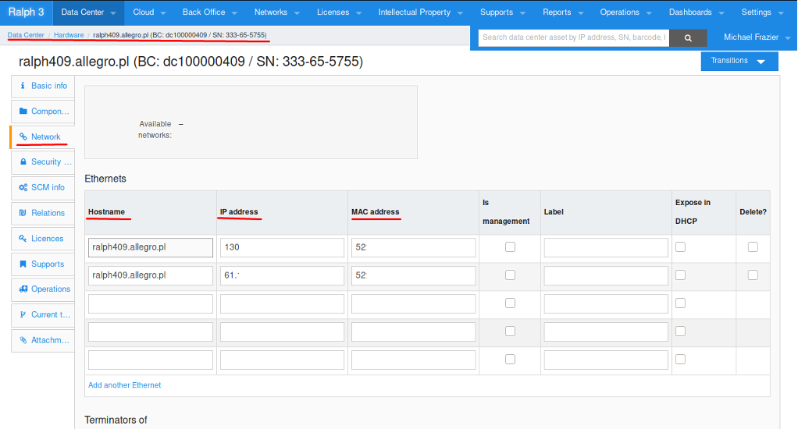
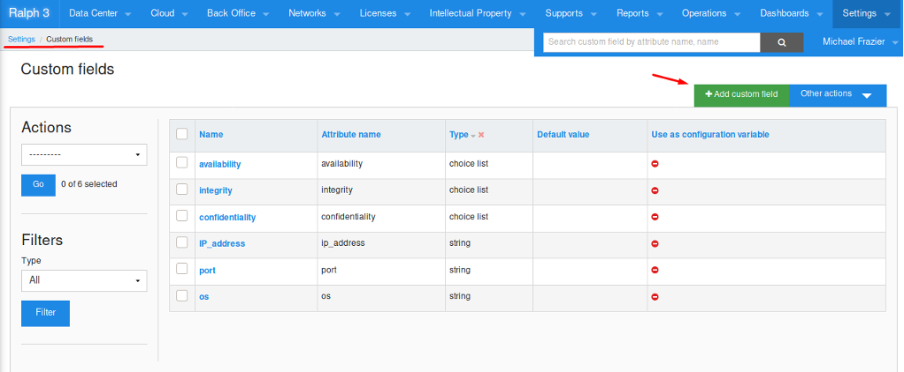
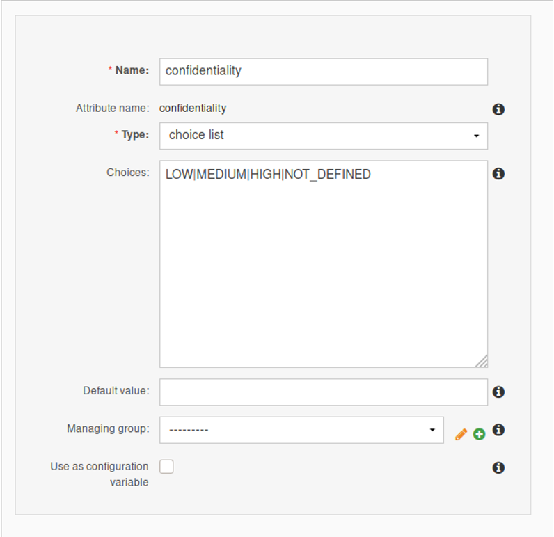
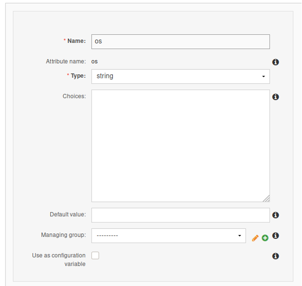
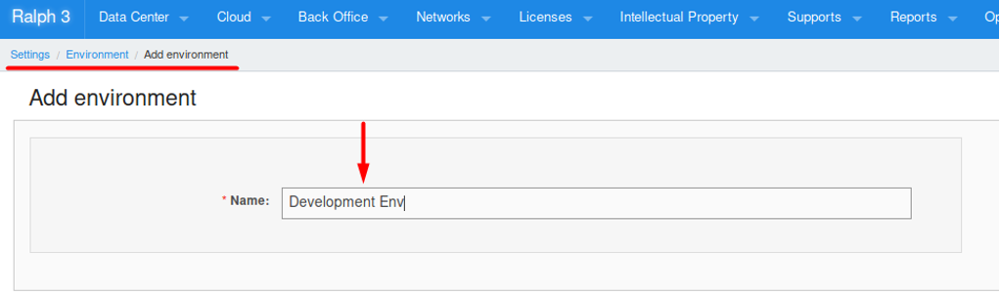
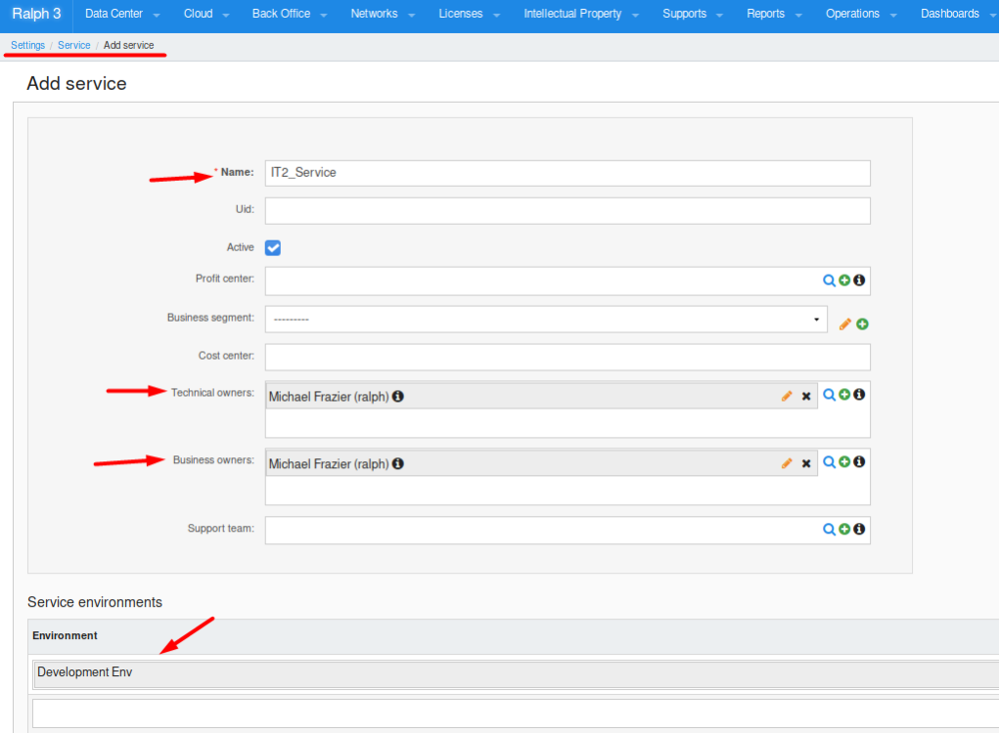
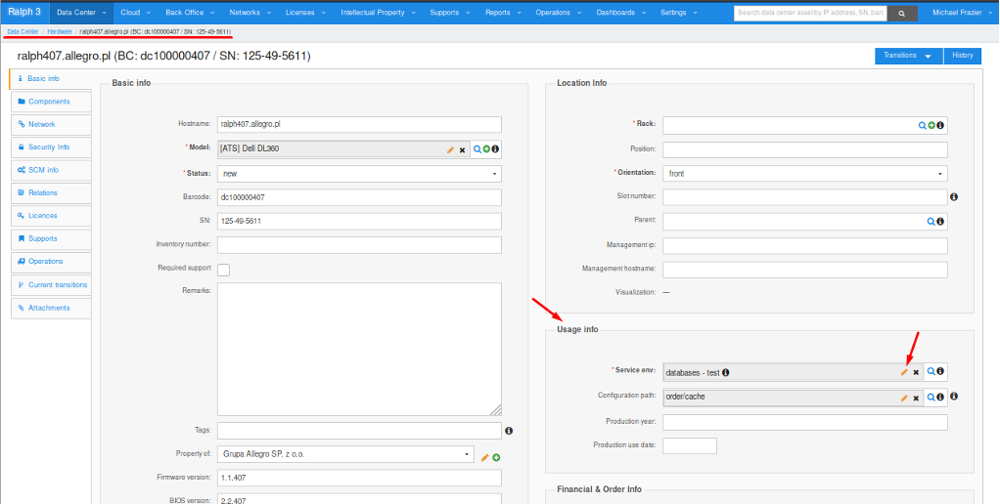
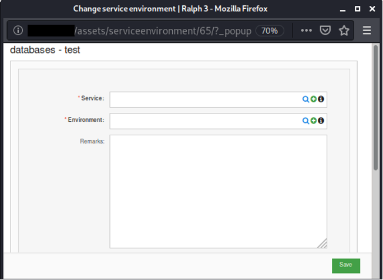
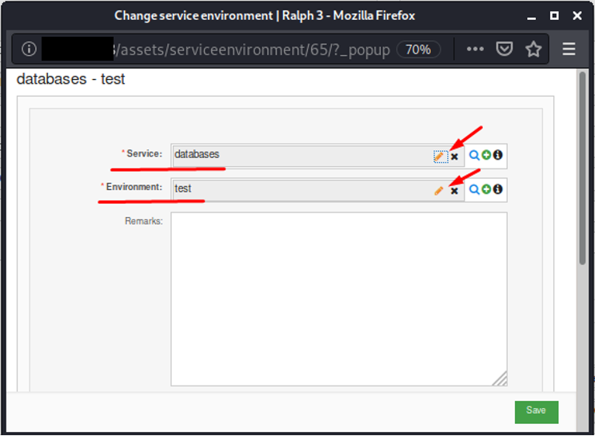

# Integration with the IT Asset Management
After successfully connecting to the Ralph asset management database, care should be taken to provide the necessary data describing the attributes of the resource. The introduction of these data will allow for effective management of vulnerabilities and resources, and for the construction of various rules, thanks to which it will be possible to use the full potential of the solution.

## Recommended fields
The fields recommended as defined for each IT asset are described below.

|Name            | Description |
|----------------|-------------|
|IP address      |IP address of the asset with the accuracy of the network interface
|MAC address     |asset MAC address with accuracy to the network interface
|hostname        |name identifying the asset
|OS              |operating system along with the exact version
|Confidentiality |criticality factor of the confidentiality of the asset and the data processed
|Integrity       |criticality factor for the integrity of the asset and the processed data
|Availability    |availability criticality factor of the asset and the processed data
|Business owner  |the persons or units responsible for the asset from the business point of view
|Technical owner |persons or units responsible for the asset from a technological point of view
|Tag             |field defining the characteristics of the resource, eg Patch Policy
|Service         |service categorization
|Environment     |categorization of the environment

Fields such as: **IP address**, **MAC address** and **hostname** are information necessary to carry out analysis. These fields should be set in the Network tab appropriately for the given asset:

Fields such as **OS**, **Confidentiality**, **Integrity**, **Availability** should be set as custom fields. The creation process for each field is outlined below.

## Custom Fields Creating
In order to create a custom field, go to the Settings / Custom Fields tab, and then click the Add custom field button.

|Name          |Description|
|--------------|-----------|
|Name          |the name of the custom field, reflected as the name of the attribute
|Type          |selection of the type of data entered into the field
|Choices       |list of accepted values
|Default value |default value if no field value is defined

## Creating Custom Fields for Attributes C/I/A
In the Settings / Custom Fields tab, select the "Add custom field" button and enter the following values in the required fields. The following screenshot shows an example of the entered values for the **confidentiality** field. The **integrity** and **availability** fields should be created similarly, as described in the table below.

## Creating custom fields for os
In the custom field adding field, create a field called **os**. This field takes a string value and corresponds to the object attributes describing the operating system together with the exact version.  

## Setting up service fields, service owners, and resource environment
### Environment configuration
To configure the environment, visit the **Settings / Environment** tab and use the **Add environment** button to define the name of the environment for a given resource group.

### Service configuration
Before defining a service for a given asset or group, the given service category should be added in the **Settings / Services** panel using the **Add service** button. The fields to be completed are **Name**, **Technical Owners**, **Business owners**, **Environment**. Each resource in the database should have an assigned owner or unit responsible for the asset in terms of business and technology.

|Field|Value
|-----|-----
|Name               |name of the service or service group
|Technical Owners   |determining a person or group technically responsible for the activity, creating an account for such a person or selecting it from previously created accounts
|Business owners    |determining a person or group responsible for the business activity, creating an account for such a person or selecting it from previously created accounts
|Environment        |assigning a previously created environment for the service resource group

### Assignment of a service to an asset
Fields containing the description of the service, and the environment in which the resource resides are set and edited from the asset details panel. Select a given asset and then, in the **Usage Info** table, define its service and environment in the editing panel marked as **Service env**.

After pressing the edit button, a new window will appear allowing you to add the necessary information.

