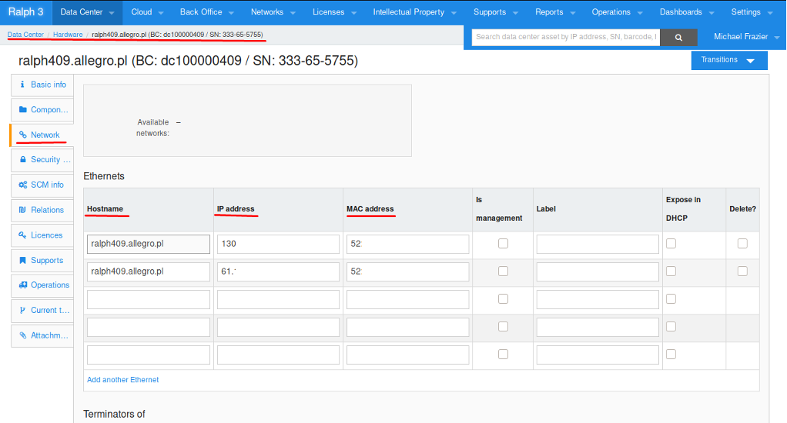
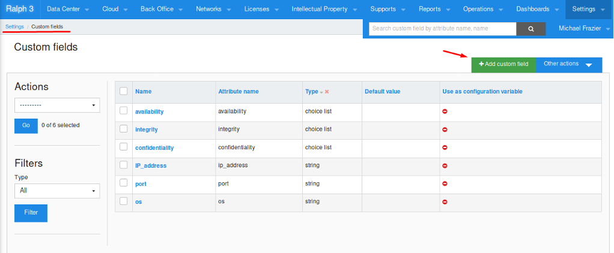
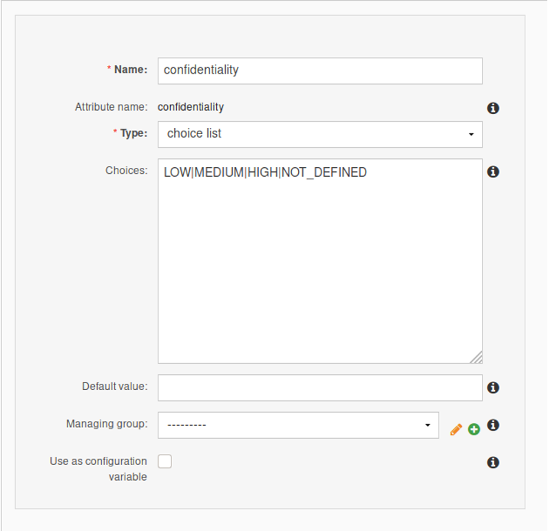
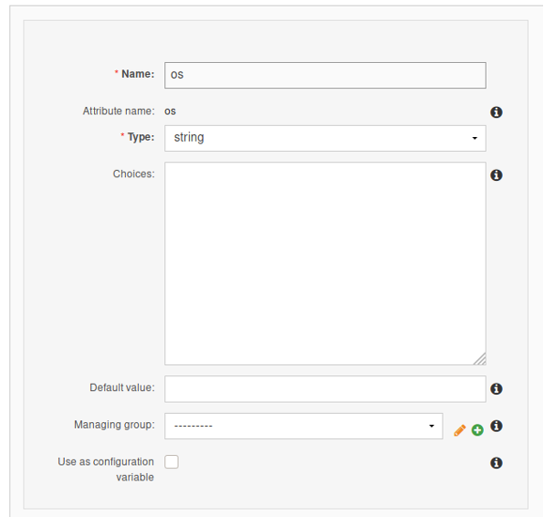
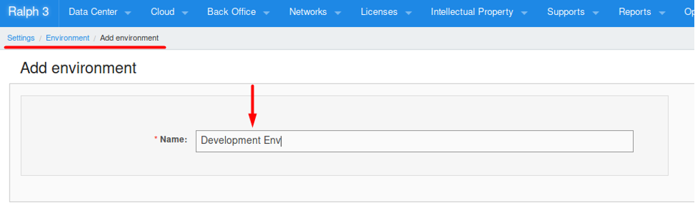
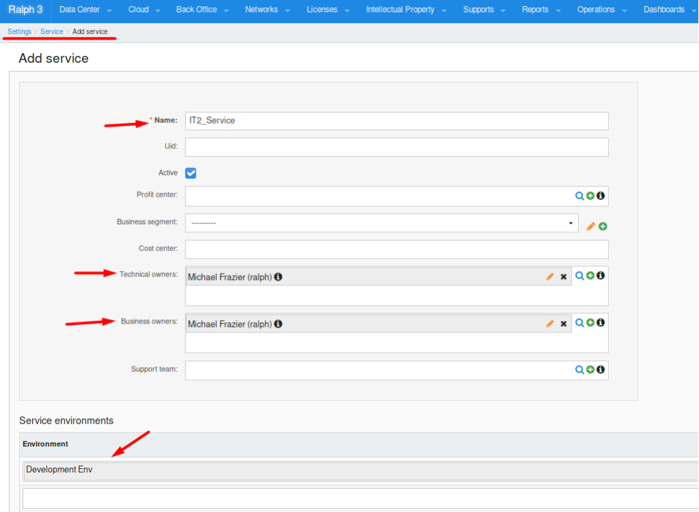
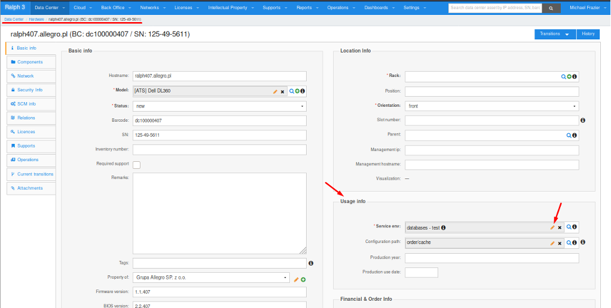
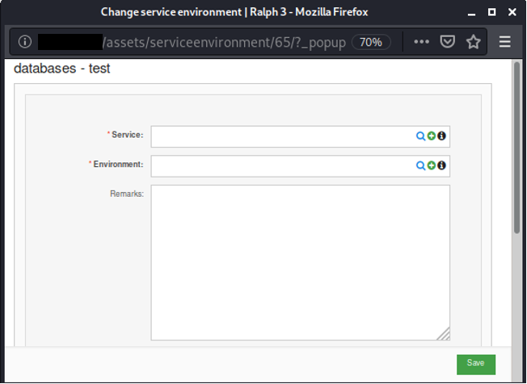
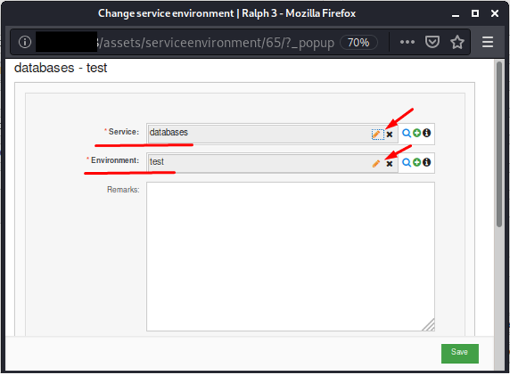

# Integration with IT asset management

After successfully connecting to the Ralph asset-management database,
populate the necessary attributes describing every resource. Doing so
enables effective vulnerability and asset management and lets you build the
rules that bring out the full potential of VMC.

## Recommended fields

The fields recommended for every IT asset:

| Name            | Description                                                                  |
|-----------------|------------------------------------------------------------------------------|
| IP address      | IP address of the asset (at network-interface granularity).                  |
| MAC address     | MAC address of the asset (at network-interface granularity).                 |
| Hostname        | Name identifying the asset.                                                  |
| OS              | Operating system together with the exact version.                            |
| Confidentiality | Confidentiality criticality factor of the asset and the data processed.      |
| Integrity       | Integrity criticality factor of the asset and the data processed.            |
| Availability    | Availability criticality factor of the asset and the data processed.         |
| Business owner  | Person or unit responsible for the asset from the business perspective.      |
| Technical owner | Person or unit responsible for the asset from the technical perspective.    |
| Tag             | Resource characteristics (for example, *Patch Policy*).                      |
| Service         | Service categorisation.                                                      |
| Environment     | Environment categorisation.                                                  |

**IP address**, **MAC address** and **hostname** are required to run the
analysis. They are set in the **Network** tab of the asset:

**OS**, **Confidentiality**, **Integrity** and **Availability** are set as
custom fields. The creation process is outlined below.

## Creating custom fields

To create a custom field go to **Settings → Custom fields** and click
**Add custom field**.

| Field         | Description                                                       |
|---------------|-------------------------------------------------------------------|
| Name          | Name of the custom field; becomes the attribute name.             |
| Type          | Type of the data stored in the field.                             |
| Choices       | List of accepted values.                                          |
| Default value | Default value used when the field is left blank.                  |

## Custom fields for the C / I / A attributes

In **Settings → Custom fields**, click **Add custom field** and fill in the
form with the values for **confidentiality**. Repeat for **integrity** and
**availability** with the matching values.

## Custom field for the OS attribute

Create a custom field called **os**. It takes a string value and corresponds
to an attribute describing the operating system along with the exact
version.

## Setting up services, owners and environments

### Environment configuration

To configure environments go to **Settings → Environment** and use **Add
environment** to define a name for the environment of a given resource
group.

### Service configuration

Before assigning a service to an asset or a group, add the service category
under **Settings → Services** using **Add service**. The required fields are
**Name**, **Technical owners**, **Business owners** and **Environment**.
Every resource in the database should have an owner or a unit responsible
for it from both the business and the technical side.

| Field            | Value                                                                                            |
|------------------|--------------------------------------------------------------------------------------------------|
| Name             | Name of the service or service group.                                                            |
| Technical owners | Person or group technically responsible. Create an account or pick an existing one.              |
| Business owners  | Person or group responsible from the business side. Create an account or pick an existing one.   |
| Environment      | Assign a previously created environment to the service / resource group.                         |

### Assigning a service to an asset

Service and environment fields are edited from the asset details panel.
Open the asset and edit the **Service env** entry in the **Usage info**
table:

After pressing **Edit**, a new window allows you to add the required
information:

