# Administration

The operations performed in the context of the VMC administrator to configure
and add the parameters necessary for the system to function correctly are
discussed below. Configuration changes are made at the URL
`http://VMC_address`, where `VMC_address` is the dedicated domain or IP
address of the machine on which the software is installed.

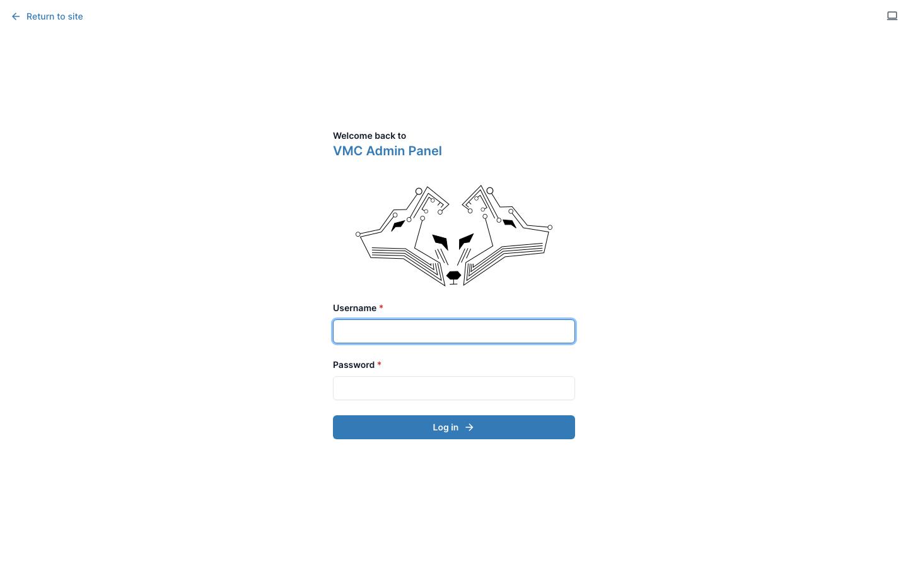

## Adding vulnerability scanners

VMC integrates with the OpenVAS and Nessus vulnerability scanners. A scanner
instance is added in the **Scanners → Configs** table by pressing the **+ ADD
CONFIG** button in the upper-right corner. Communication with Nessus goes
through its REST API; communication with OpenVAS goes through the OMP and GVM
protocols, which require additional settings on the scanner administrator's
side.

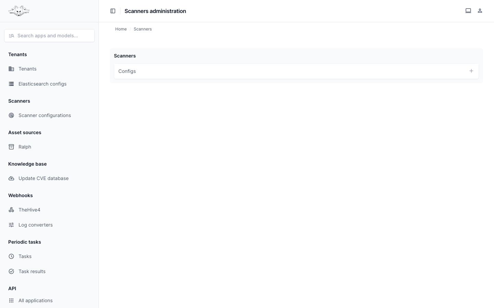

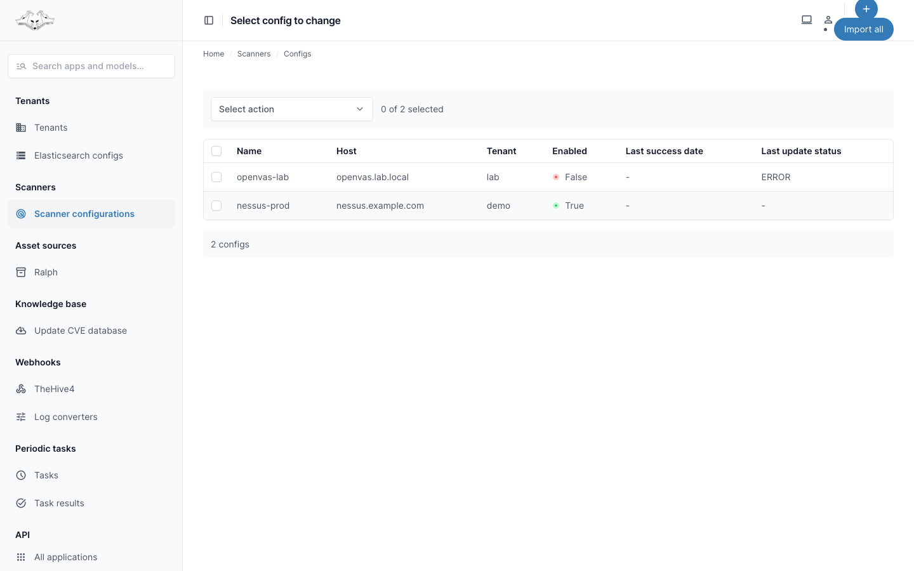

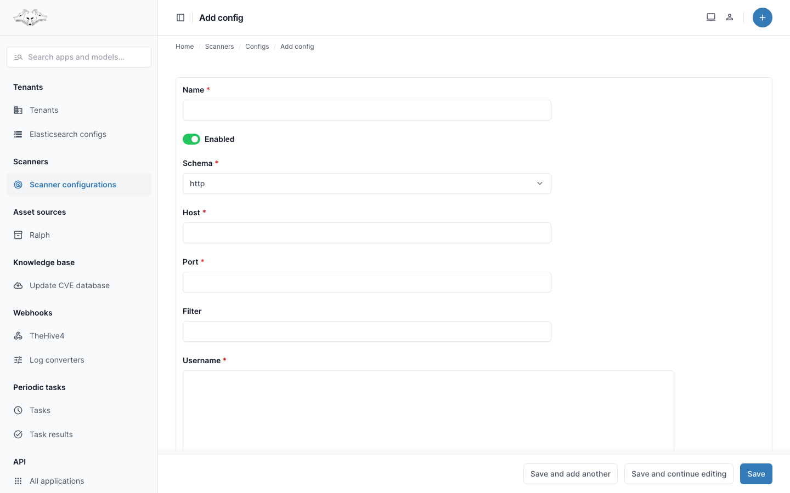

In the **ADD CONFIG** panel, enter the scanner configuration:

| Name     | Description                                                                                                                                                              |
|----------|--------------------------------------------------------------------------------------------------------------------------------------------------------------------------|
| Name     | Name of the scanner instance.                                                                                                                                            |
| Enabled  | Configuration enabled (`true` by default).                                                                                                                               |
| Schema   | Connection protocol — `http` or `https`.                                                                                                                                 |
| Host     | IP address of the machine on which the scanner is installed.                                                                                                             |
| Port     | Port on which the scanner is listening.                                                                                                                                  |
| Filter   | Optional. For Nessus, a regex that selects which folders of scans are taken into account. For OpenVAS, behaves as the scanner's built-in tag functionality.              |
| Username | Privileged user account name in the scanner application.                                                                                                                 |
| Password | User account password.                                                                                                                                                   |
| Insecure | SSL certificate verification parameter (disabled by default).                                                                                                            |
| Tenant   | Tenant to which the data from the vulnerability scans will be associated.                                                                                                |
| Scanner  | Vulnerability scanner — OpenVAS or Nessus.                                                                                                                               |

Example:

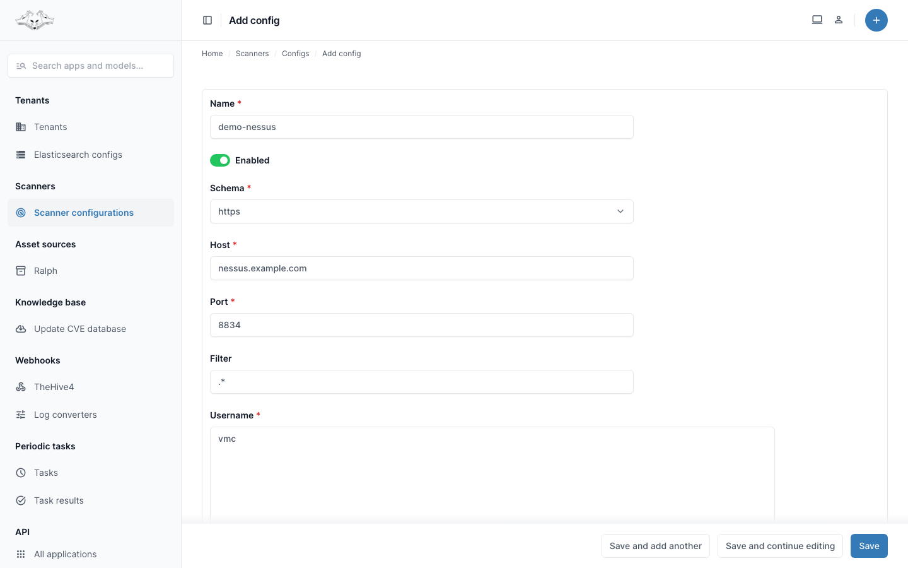

After filling in all the fields, save the configuration by clicking **Save**
on the bottom-right of the form. On success, a confirmation message appears:

> The config "*\<scanner instance name\>*" was added successfully.


> [!NOTE]
> By default GVM listens on a UNIX socket, so to connect VMC to OpenVAS the
> `gvmd` configuration must expose it on TCP. In `/etc/lib/systemd/system/gvmd.service`,
> change:
>
> ```ini
> ExecStart=/usr/sbin/gvmd --osp-vt-update=/run/ospd/ospd.sock --listen-group=_gvm
> ```
>
> to:
>
> ```ini
> ExecStart=/usr/sbin/gvmd --osp-vt-update=/run/ospd/ospd.sock --listen-group=_gvm --listen 0.0.0.0 --port 9390
> ```
>
> then reload and restart:
>
> ```bash
> systemctl daemon-reload
> systemctl restart gvmd.service
> ```

## Importing data from the scanner

To load data from a correctly added scanner, go to **Scanners → Configs**,
tick the checkbox next to the scanner you want to import from, choose
**Import selected configs** from the action dropdown and click **GO**.


If the import can start, *Import started* appears at the top of the page:

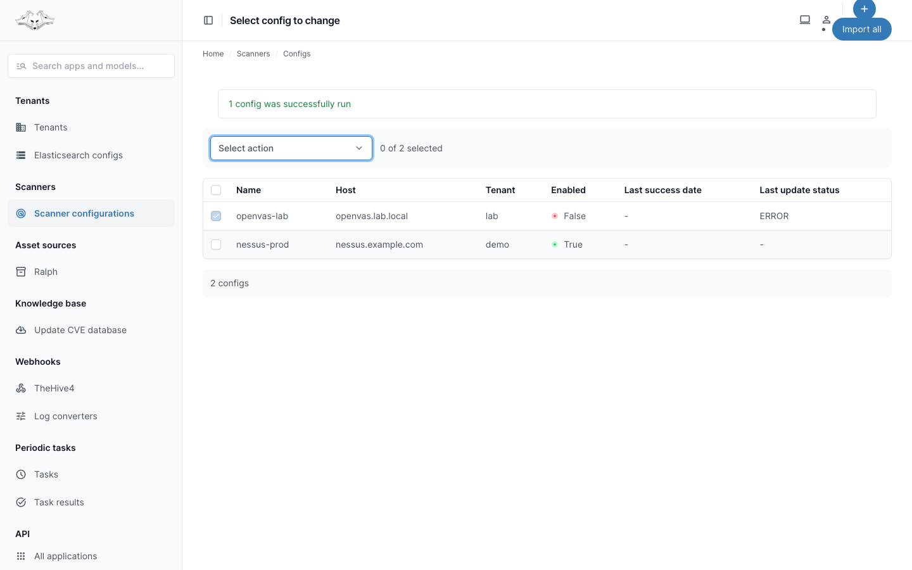

If a tenant-scoped import or vulnerability calculation is already in
progress, a warning is shown instead:


Each configuration also carries a status that reflects the latest import:

| Status      | Description                                                                                       |
|-------------|---------------------------------------------------------------------------------------------------|
| PENDING     | Waiting for the import to start.                                                                  |
| IN PROGRESS | Import in progress.                                                                               |
| ERROR       | Import finished with an error; the details are in the configuration's "Error description" field. |
| SUCCESS     | Import finished successfully.                                                                     |

## Disabling and enabling scanner configurations

To toggle a configuration on or off, open **Scanners → Configs**, tick the
checkbox next to the configurations you want to update and choose one of:

- **Enable selected configs** — enable the configuration.
- **Disable selected configs** — disable the configuration.
- **Toggle activity of selected configs** — flip the current state.

Then click **GO**.


The **Enabled** column shows a green indicator when the configuration is
active and a red indicator when it is disabled.


Configurations can be turned on and off freely at any time.

## Adding an IT resource management database

VMC integrates with the Ralph IT-asset-management database. The integration is
configured under **Asset sources → Ralph** in the sidebar.


In the **Configs** panel, click the **+** button in the upper-right corner
and fill in the asset-base configuration:

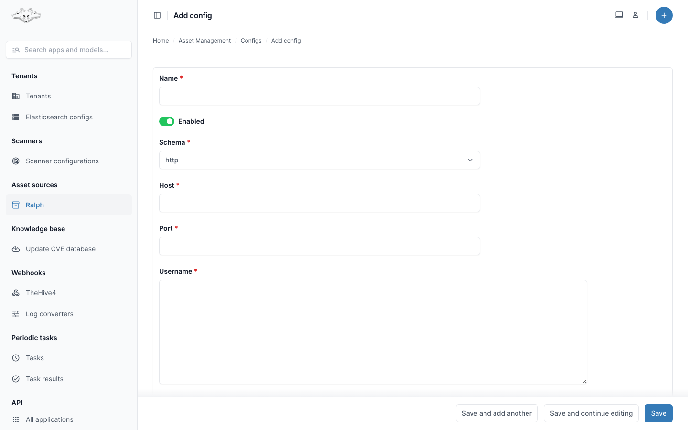

| Name     | Description                                                              |
|----------|--------------------------------------------------------------------------|
| Name     | Name of the resource-database instance.                                  |
| Schema   | Connection protocol — `http` or `https`.                                 |
| Host     | IP address of the machine on which the resource base is installed.       |
| Port     | Port on which the resource base is listening.                            |
| Username | Privileged user account name in the resource-base application.           |
| Password | User account password.                                                   |
| Insecure | SSL certificate verification parameter (disabled by default).            |
| Tenant   | Tenant to which the resource-database data will be associated.           |

Example:

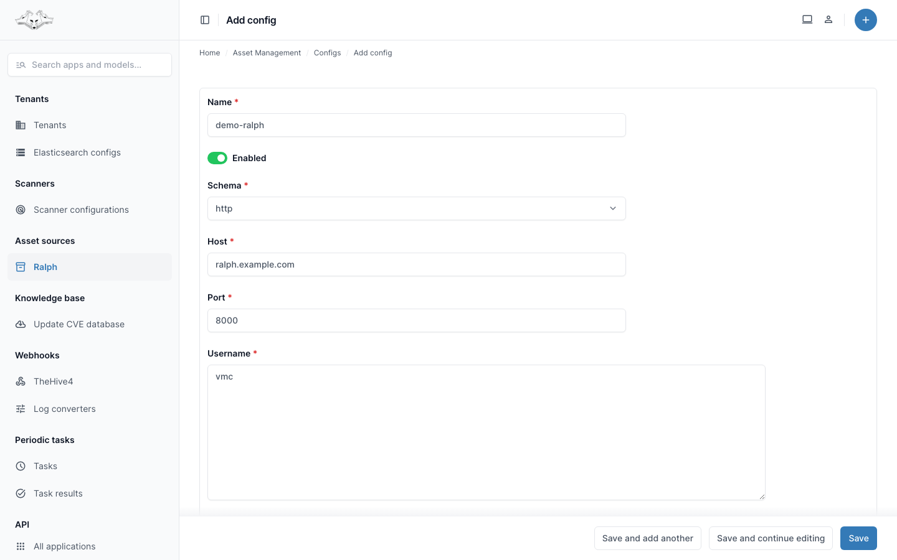

After filling in all the fields, save the configuration. On success:

> The config "*\<asset database instance name\>*" was added successfully.

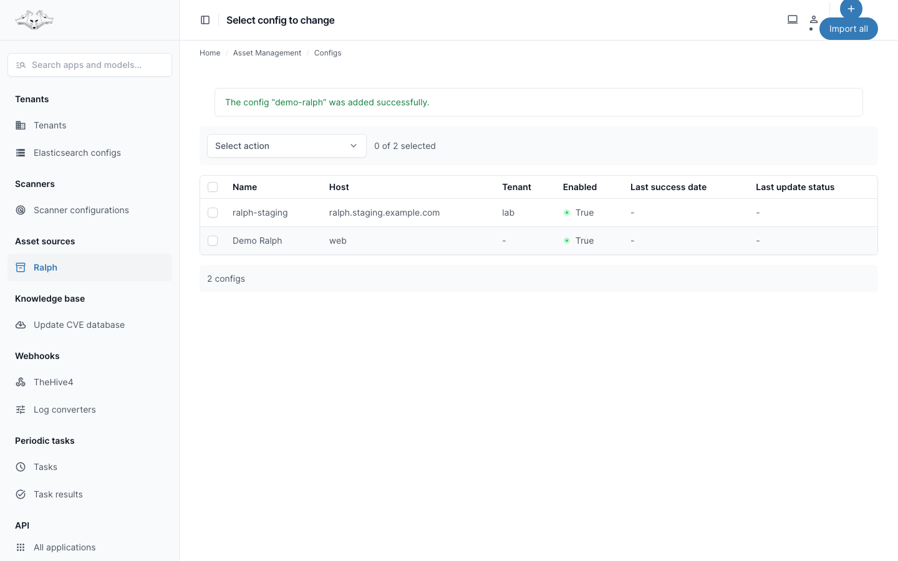

## Data import from an IT resource management database

To pull data from a correctly added Ralph instance, go to **Asset sources →
Ralph**, tick the checkbox next to the configuration you want to import from,
choose **Import selected configs** from the action dropdown and click **Go**.

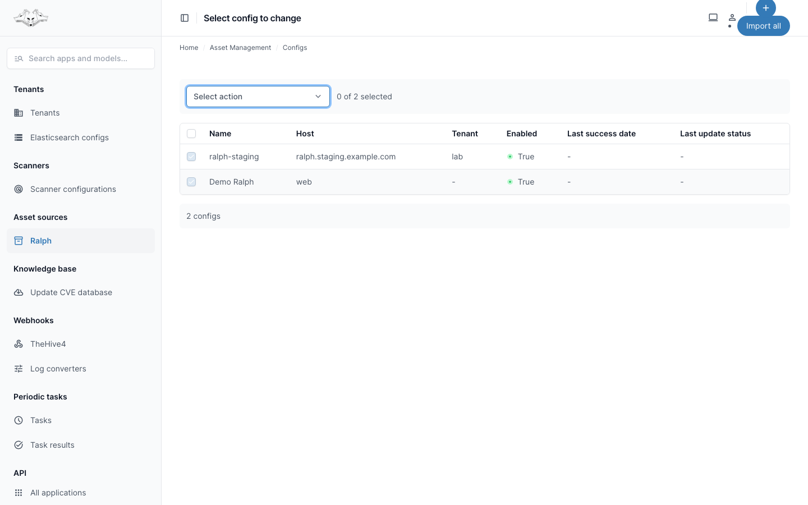

If the import can start, *Import started* appears at the top of the page:


If an import or vulnerability calculation is already running, a warning is
shown instead:


The same status fields as the scanner imports apply (`PENDING`, `IN PROGRESS`,
`ERROR`, `SUCCESS`).

## Creation of API tokens

VMC supports integration with external services through a dedicated REST API.
To enable it, create a token bound to a specific user under **API → API
tokens**.

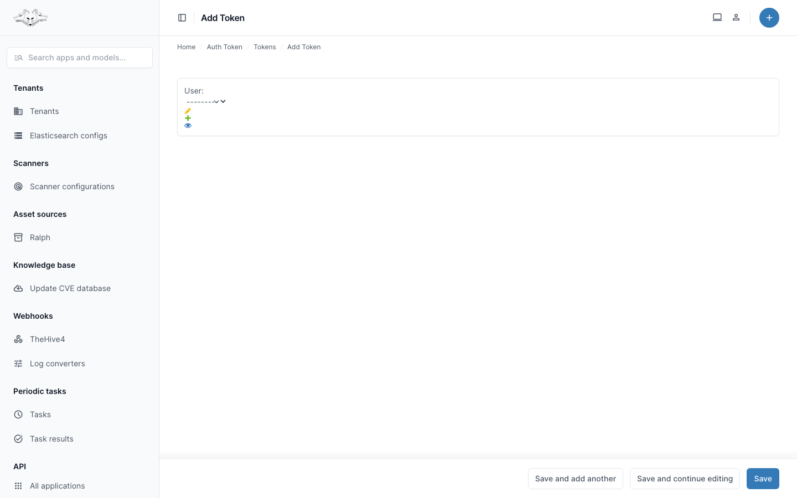

In the **Tokens** panel, click the **+** button in the upper-right corner and
select the user for whom the token will be generated.

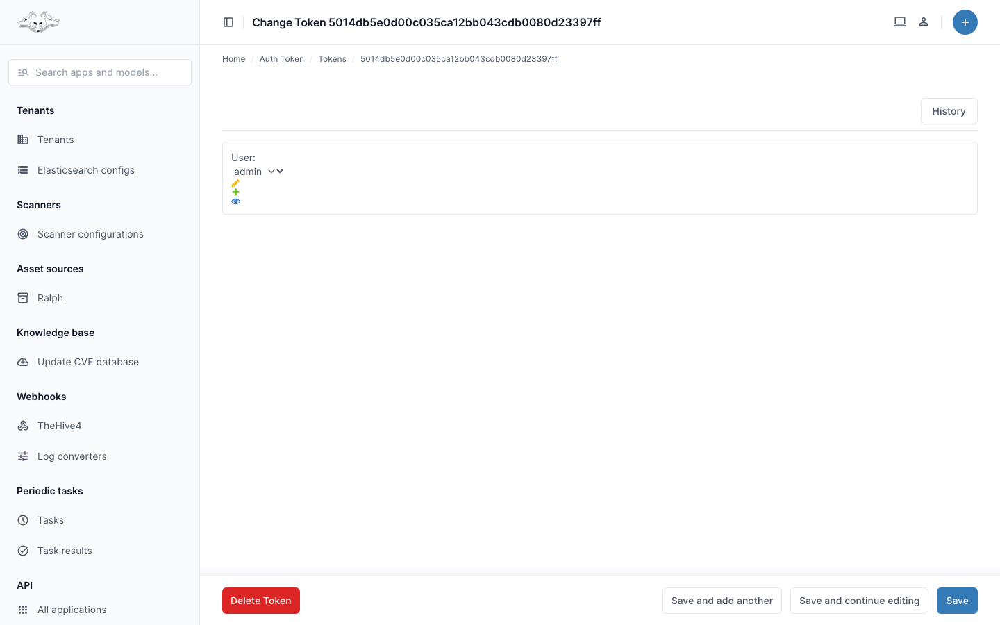

After **Save**, the generated token is displayed in the admin panel.

## Support for multiple organisations or groups

Data separation between organisations is achieved through tenants. Each
tenant owns a logical slice of the Elasticsearch indexes. Tenants are added
in **Tenants → Tenants**, button **+ ADD TENANT** in the upper-right corner.

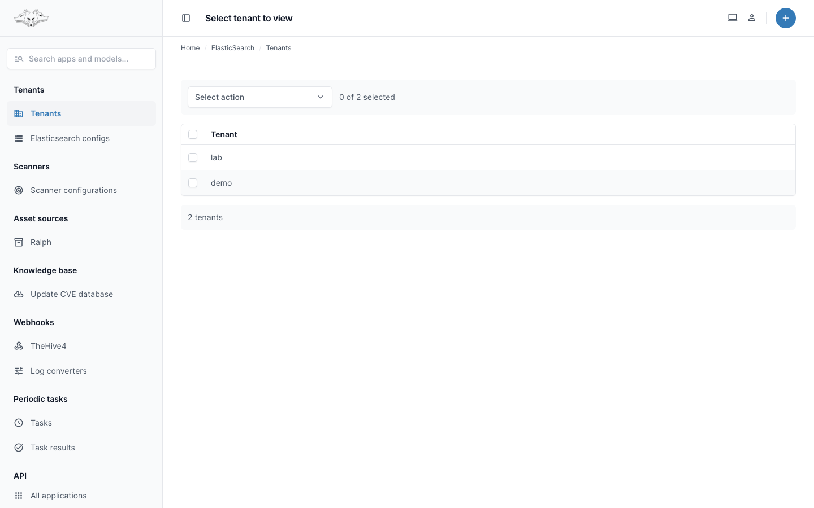

Before adding a tenant an **Elasticsearch config** (a prefix) must exist. If
none has been defined, create one in **Tenants → Elasticsearch configs** via
**+ ADD CONFIG**.

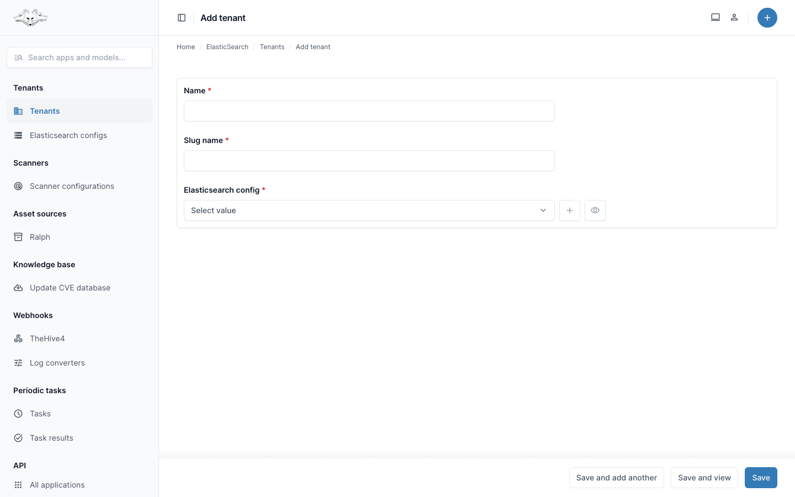

Fill in the tenant configuration:

| Name                  | Description                                                                                  |
|-----------------------|----------------------------------------------------------------------------------------------|
| Name                  | Tenant name; becomes a component of the Elasticsearch index name.                            |
| Slug name             | Slug used to distinguish between tenant indexes in Elasticsearch (lowercase alphanumeric).   |
| Elasticsearch config  | The previously defined configuration from **Tenants → Elasticsearch configs**.               |

Example:

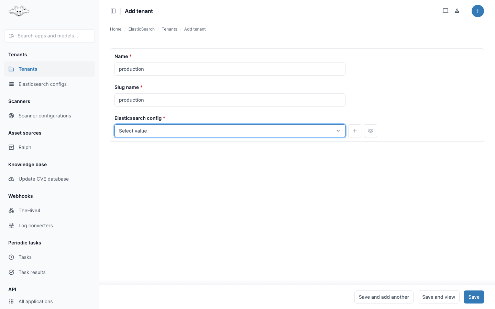

After saving, on success:

> The tenant "*\<Name\>*" was added successfully.

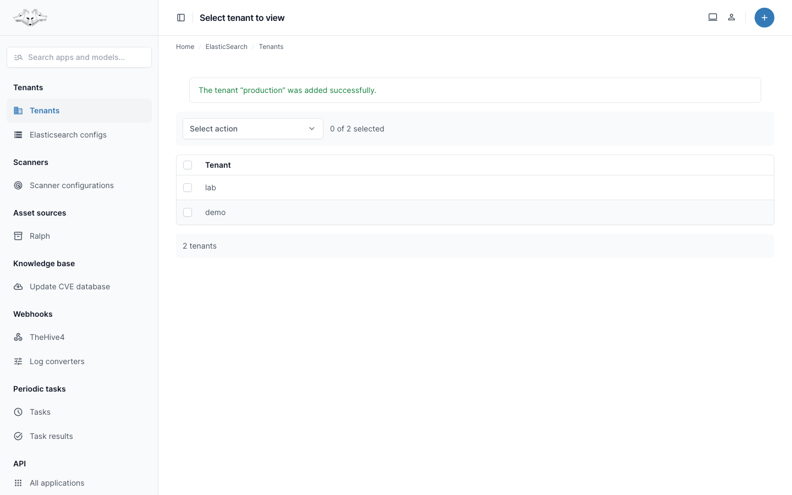

Once the tenant is added, the corresponding Elasticsearch indexes are created
using the pattern:

```
<prefix>.<slug-name>.<document>
```

## Setting up schedules with tasks

VMC has a built-in scheduler that lets the administrator define an exact time
or interval for tasks such as updating data from vulnerability scanners or
the asset database.

### Setting the time interval

Time intervals and crons are managed under **Periodic tasks → Tasks**. For
example, to add a recurring 6-hour interval go to **Periodic tasks →
Intervals**.

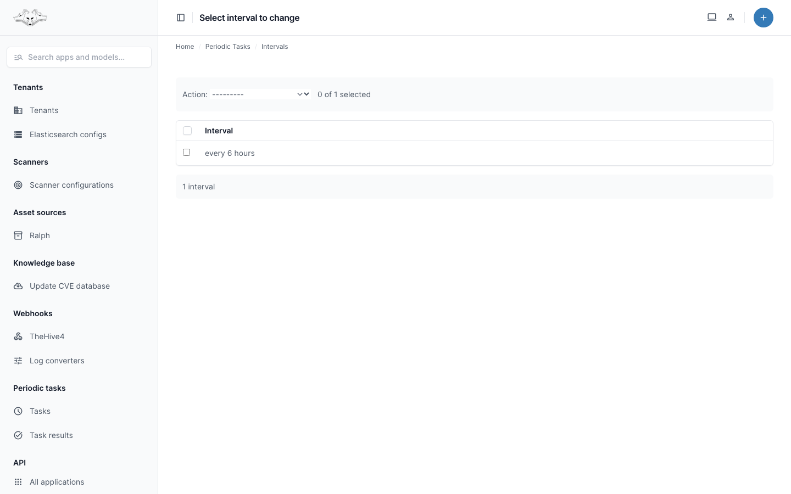

Click the **+** button in the upper-right corner and fill in the required
data.

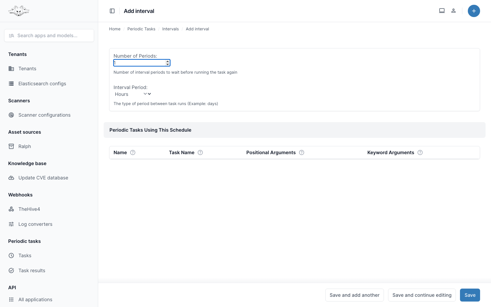

### Assign a task to a defined interval

Once the interval exists, define a specific schedule under **Periodic tasks →
Tasks**. Click **+ ADD PERIODIC TASK** in the upper-right corner and fill in
the required data.

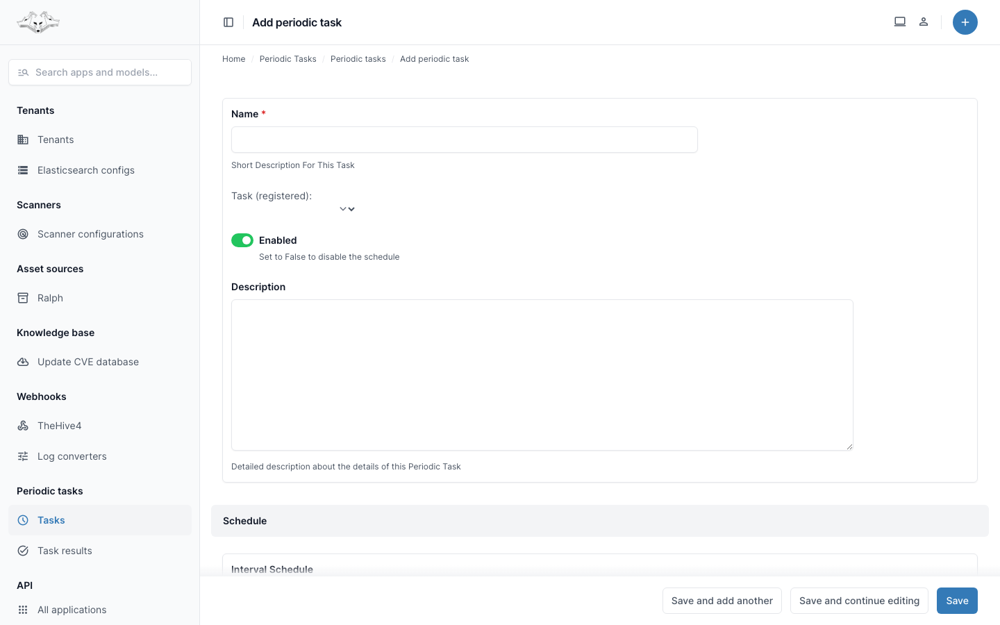

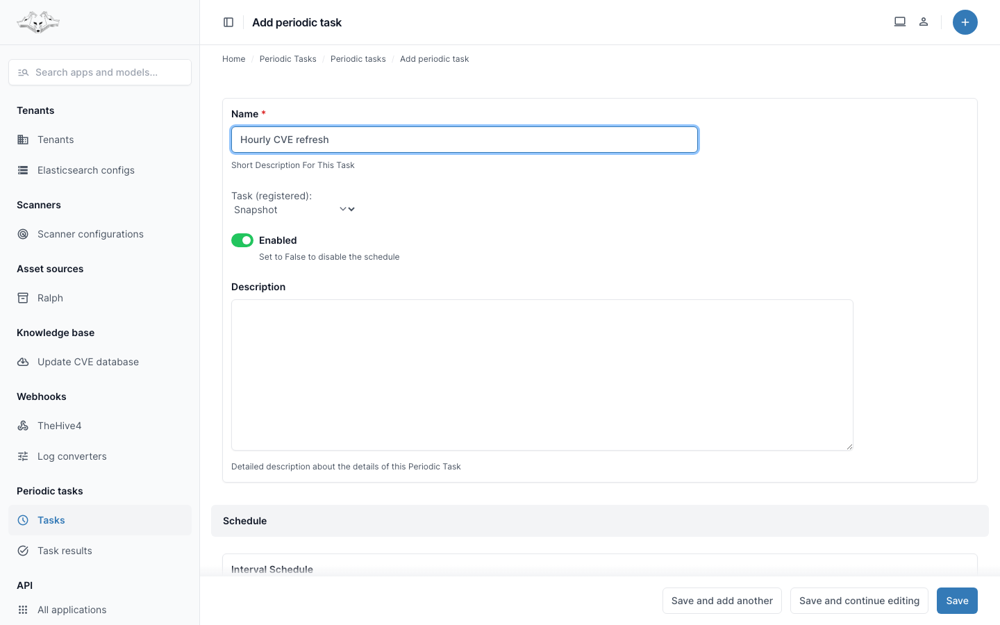

### Predefined tasks

When picking a value for **Task (registered)**, the following tasks are
available:

| Name                  | Description                                                            |
|-----------------------|------------------------------------------------------------------------|
| Snapshot              | Create a historical copy of your data.                                 |
| Update knowledge base | Retrieve data from the database of vulnerabilities and weaknesses.     |
| Update all assets     | Download data from the asset database.                                 |
| Update all scanners   | Retrieve data from the vulnerability scanner.                          |

### Verification of scheduled-task results

Results of scheduled tasks are listed under **Periodic tasks → Task results**
(the `django_celery_results` table). The list contains the task ID, name,
execution date and status.

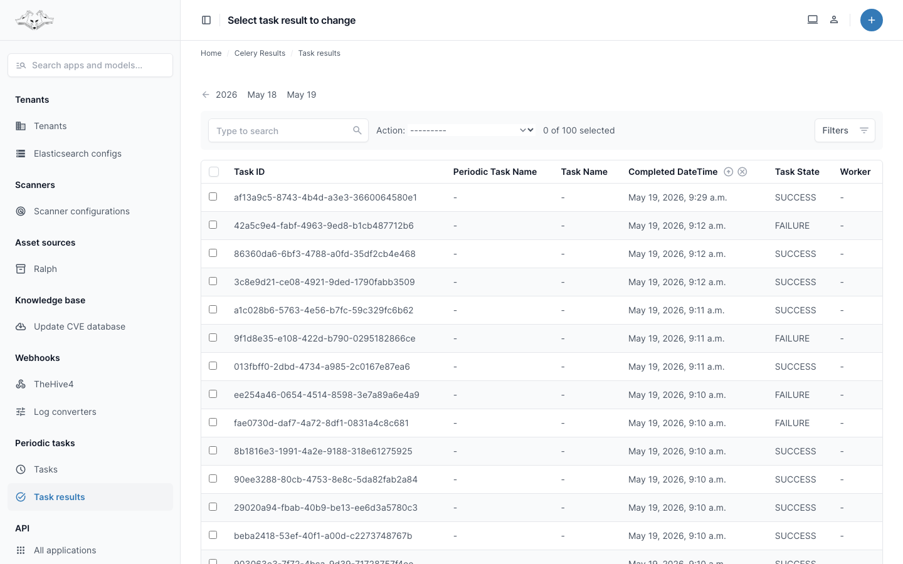

## User administration

VMC supports user- and group-level authorisation management. New users are
added under **Users → Users** by pressing **+ ADD USER** in the upper-right
corner.

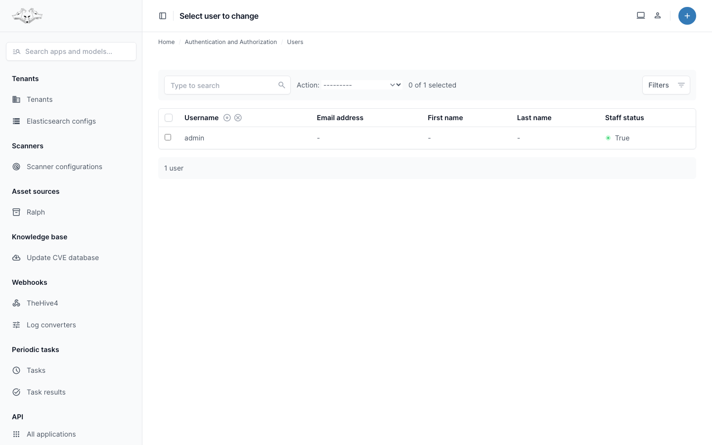

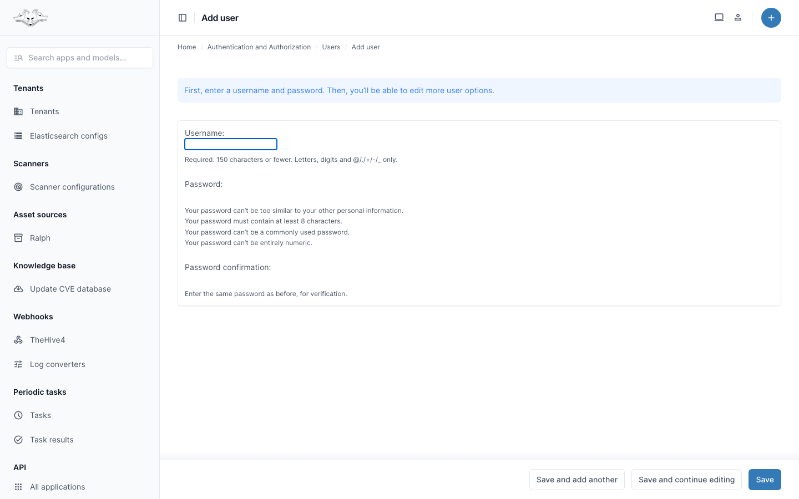
