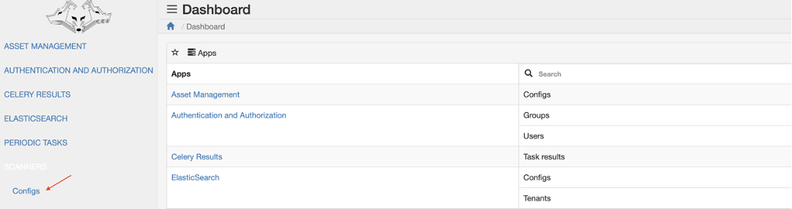

# Administration
The operations that are performed in the context of the VMC administrator to configure and add parameters necessary for the proper functioning of the system are discussed below. Configuration changes are made at the url `http://VMC_address`, where VMC_address is the dedicated domain or IP address of the machine where the software is installed.

## Adding vulnerability scanners
VMC software includes integration with OpenVas and Nessus vulnerability scanners. Adding a scanner instance is done in the Scanners / Configs table by pressing the ADD CONFIG button in the upper right corner. Communication with the Nessus scanner takes place using the available REST API, while communication with the OpenVas scanner takes place using the OMP and GVM protocols, which requires additional settings on the side of the scanner administrator.

*SCANNERS tab*

*Scanners -> Configs tab*

*Adding a Scanner Configuration*

In the **ADD CONFIG** panel, enter the correct scanner configuration:

| Name    | Description
|---------|-----
|Name     |The name of the scanner instance|
|Enabled  |Configuration enabled (true by default)
|Schema   |Connection protocol (selectable from http and https)
|Host     |The IP address of the machine on which the scanner is installed
|Port     |The port on which the scanner is listening
|Filter   |Optional. In the case of the Nessus scanner, it allows you to specify with regex which folders with scans should be taken into account. For the OpenVas scanner, the filters act as the functionality of the tags built into the scanner.
|Username |Privileged user's account name in the scanner app
|Password |User account password
|Insecure |SSL Certificate Verification Parameter (Disabled by default)
|Tenant   |Tenant with which the data from the vulnerability scans will be associated
|Scanner  |Vulnerability scanner (to choose from OpenVAS and Nessus)

Example:

After filling in all the fields, save the configuration by clicking the **Save** button on the left side of the form. If all the data is correct, the following information will appear:

The config “*The name of the scanner instance*” was added successfully.

## Importing data from the scanner
To load data from a correctly added scanner, go to the **Scanners/Configs** tab, select the checkbox next to the previously added scanner from which you want to import data and select the **Import selected configs** option from the list, and then click **GO**.

If the data import is possible, the following message will appear on the screen: *Import started*.

If the system is already importing data (for a given tenant) or performing calculations for the vulnerability and it will not be possible to start a new import, a message will appear in the same place with the information:

Additionally, when importing data from the scanner, additional statuses assigned to a specific configuration are available:

|Name       |Description
|-----------|--------
|PENDING    |Waiting for the import to start
|IN PROGRESS|Import in progress
|ERROR      |Import finished with an error, the error description can be found in the configuration at the bottom in the "Error description" field
|SUCCESS    |Successful import

## Disabling and Enabling the Scanner Configuration
To turn off the configuration or turn it on again, go to the **Scanners/Configs** tab, select the checkbox next to the previously added scanner, turn it off / on and select the option:
* Enable selected configs - for enable configuration
* Disable selected configs - to disable configuration

And then click **GO** button

The configuration status will be shown in the **Enabled** column by a red sign - inactive, and a green sign - active.

Configurations can be turned on and off at will.

## Adding an IT resource management database
The VMC software integrates with an IT resource management database called Ralph. Adding is done in the side menu after pressing the **ASSET MANAGEMENT** -> **Configs** button.

In the **Configs** panel, click the + button in the upper right corner and then enter the correct configuration of the resource base.

| Name   | Description |
|--------|-------------|
|Name    |The name of the resource database instance
|Schema  |Connection protocol (selectable from http and https)
|Host    |The IP address of the machine where the resource base is installed
|Port    |The port on which the resource base is listening
|Username|Privileged user account name in the resource base application
|Password|User account password
|Insecure|SSL Certificate Verification Parameter (Disabled by default)
|Tenant  |The tenant to which the resource database data will be associated

Example:

After filling in all the fields, save the configuration by clicking the **Save** button on the left side of the form. If all the data is correct, a message will appear:

The config “*The name of the asset database instance*” was added successfully.

## Data import from an IT resource management database
To load data from a correctly added resource database, go to the **ASSET MANAGEMENT** -> **Configs** tab, select the checkbox next to the previously added database from which we want to import data, and then select Import selected configs from the drop-down menu and click the **Go** button.

If the data import is possible, the following message will appear on the screen: *Import started*.

If the system is already importing data (for a given tenant) or performing vulnerability calculations, and it will not be possible to start a new import, a message will appear in the same place with the information:

Additionally, when importing data from the scanner, additional statuses assigned to a specific configuration are available:

|Name        | Description
|------------|-------------
|PENDING     |Waiting for the import to start
|IN PROGRESS |Import in progress
|ERROR       |Import finished with an error, the error description can be found in the configuration at the bottom in the "Error description" field
|SUCCESS     |Successful import

## Creation of API Tokens

VMC allows integration with external services using a dedicated API. To do this, create a Token that is assigned to a specific user. A new token is added in the **Auth Token/Tokens** tab.

In the **Tokens** panel, click the + button in the upper right corner and then select the user for whom the Token will be generated.

After selecting the **Save** button, the generated token will appear in the admin panel.

## Support for Multiple Organizations or Groups
Data separation and indexation using tenants allows for effective management of data assigned to individual organizations. The addition is made in the **ELASTICSEARCH/Tenants** table after pressing the **ADD TENANT** button in the upper right corner.

Before adding a tenant, you must have an elasticsearch configuration (prefix), in the absence of it, you can do it by going to the **ELASTICSEARCH/Configs** tab, and then selecting the **ADD CONFIG** option

The correct Tenants configuration must be entered in the **ELASTICSEARCH/Tenants** table.

|Name                  |Description
|----------------------|---
|Name                  |Name of the tenant that will be added to the indexes in Elasticsearch
|Slug name             | Name used to distinguish between tenant indexes in Elasticsearch
|Elasticsearch config  |The checkbox in which we select the configuration previously defined in the ELASTICSEARCH/Configs table.

Example:

After filling in all the fields, save the configuration. If the operation is successful, the following message will appear on the screen: The tenant “Name” was added successfully.

After adding and configuring the tenant correctly, the indexes will be created in ElasticSearch in the form:
[prefix].[slugname].[document]

## Setting up schedules with tasks
VMC has job scheduling functionality where the system administrator can define the exact time or time interval for tasks such as updating data from vulnerability scanners or asset database.

### Setting the time interval
Setting the time interval or a specific date and time of the defined task is done in the **Periodic Tasks** table. For example, adding a time interval to the **Periodic Tasks** -> **Intervals table**.

After pressing the + button in the upper right corner, it is necessary to complete the required data.

### Assign a task to a defined time
After correct configuration and defining the time for the task, you can start to define a specific schedule in the **Periodic Tasks/Periodic** tasks table. After pressing the **ADD PERIODIC TASK** button in the upper right corner, it is necessary to complete the required data.

### The list of predefined tasks
When defining a schedule with tasks as Task (registered) value, you can select the following tasks from the list:

|Name | Description
|-----|------------
|Snapshot              |Create a historical copy of your data.
|Update knowledge base |Retrieving data obtained from the database of vulnerabilities and weaknesses.
|Update all assets     |Downloading data received from the asset database.
|Update all scanners   |Retrieving data received from the vulnerability scanner.

### Verification of the results of planned tasks
The results of scheduled tasks defined in the **Periodic Tasks/Periodic** tasks table are presented in the **Celery Results/Task** results table. The table contains the task ID, name, execution date and status.

## User administration
VMC enables user and group level authorization management. Adding a new user is in **AUTHENTICATION AND AUTHORIZATION\User** after pressing the **ADD** button on the right.

