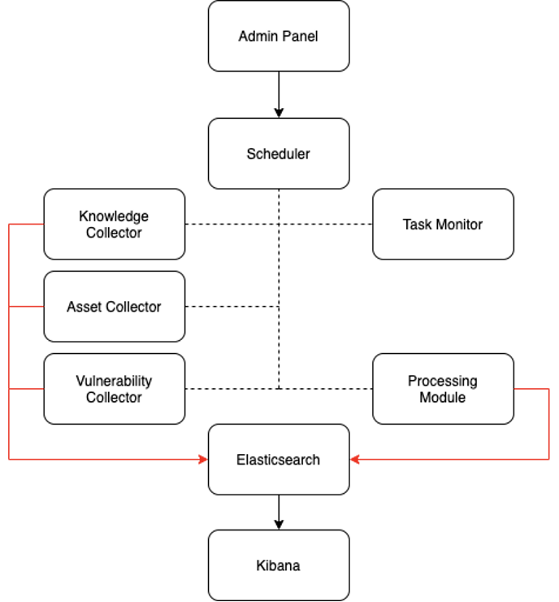
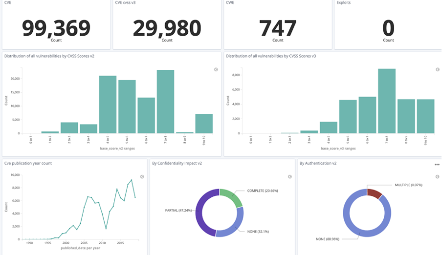

# Architecture

This section describes the architecture and operation of the VMC software which consists of four main modules: Knowledge Collector, Asset Collector, Vulnerability Collector and Processing Module. Figure below shows the flow of information. The first three modules are responsible for collecting data from various parts of the network, while the fourth, computational one, is responsible for delivering results as close to real time as possible.



All modules work independently of each other, communicating asynchronously via a queue system. Thanks to this, depending on the amount of data received by the module, it can be scaled vertically, independently of other components.

The system is configured from the administrator panel. The order and timing of data download from individual sources are controlled from the Scheduler module, while the Task Monitor allows you to view the current system status.

The entire solution has been prepared for operations in the cloud environment and is based on the Docker container technology. The data is stored in ElasticSearch, which enables its processing in full-text mode, while the Kibana tool is used for the results' presentation layer. The Python language was used to implement the components described below due to its flexibility, and the possibility of efficient data processing on the server side. The entire project includes support for tenants and allows for full data separation between specific tenants. VMC operates in operational and historical modes. The operating mode allows the user to view all changes observed by the system in real time, while the historical mode enables viewing and performing computational operations on historical data, thus improving the quality and scope of the analysis of events in the system. 

In order to simplify the principle of operation and the VMC architecture, the data processing process has been divided into individual stages following one another.

## Knowledge Collector
The Knowledge Collector module is responsible for downloading, updating and normalizing information from publicly available databases on known exploits, weaknesses (CWE - Common Weakness Enumeration) and vulnerabilities (CVE - Common Vulnerabilities and Exposures). Information sources include the National Vulnerabilities Database (NVD) and the Exploits Database. Below is the structure of the document responsible for storing information on the url of a published exploit (Listing 15), the structure responsible for storing information about the software (CPE - Common Platform Enumeration), and a standardized structure for the vulnerability, which also contains relations to the above-described documents. The document stores the entire vector that makes up the vulnerability assessment, in order to speed up the calculations and enable easier searching for the vulnerability by its characteristic features, e.g. the possibility of remote exploitation of the vulnerability. After passing the normalization process, the collected information can be displayed in the presentation layer.

```python
class ExploitDocument:
    id = Keyword()
    url = Keyword()

```

In the document representing the collected information about publicly available Exploits, the following fields are distinguished.

|Name| Description                                                         |
|----|---------------------------------------------------------------------|
|id  |exploit identifier based on address from https://www.exploit-db.com/ |
|url |URL to a page describing the identified exploit                      |

```python
class CpeDocument:
    name = Keyword()
    vendor = Keyword()
```
|Name   | Description                                                      |
|-------|------------------------------------------------------------------|
|name   |software name based on CPE                                        |
|vendor |the name of the software manufacturer based on CPE                |

```python
class CveDocument:
    id = Keyword()
    base_score_v2 = Float()
    base_score_v3 = Float()
    summary = Keyword()
    access_vector_v2 = TupleValueField(choice_type=metrics.AccessVectorV2)
    access_complexity_v2 = TupleValueField(choice_type=metrics.AccessComplexityV2)
    authentication_v2 = TupleValueField(choice_type=metrics.AuthenticationV2)
    confidentiality_impact_v2 = TupleValueField(choice_type=metrics.ImpactV2)
    integrity_impact_v2 = TupleValueField(choice_type=metrics.ImpactV2)
    availability_impact_v2 = TupleValueField(choice_type=metrics.ImpactV2)
    attack_vector_v3 = TupleValueField(choice_type=metrics.AttackVectorV3)
    attack_complexity_v3 = TupleValueField(choice_type=metrics.AttackComplexityV3)
    privileges_required_v3 = EnumField(choice_type=metrics.PrivilegesRequiredV3)
    user_interaction_v3 = TupleValueField(choice_type=metrics.UserInteractionV3)
    scope_v3 = EnumField(choice_type=metrics.ScopeV3)
    confidentiality_impact_v3 = TupleValueField(choice_type=metrics.ImpactV3)
    integrity_impact_v3 = TupleValueField(choice_type=metrics.ImpactV3)
    availability_impact_v3 = TupleValueField(choice_type=metrics.ImpactV3)
    published_date = Date()
    last_modified_date = Date()

    exploits = ExploitDoc()
    cpe = CpeDoc()
    cwe = CweDoc()
```

|Name                      | Description                                                      |
|--------------------------|------------------------------------------------------------------|
|id	                       |unique CVE vulnerability identifier
|base_score_v2             |calculated vulnerability criticality assessment based on CVSS version 2
|base_score_v3             |the calculated vulnerability criticality assessment based on CVSS version 3
|summary                   |a detailed description of the vulnerability found
|access_vector_v2          |access vector for vulnerability exploitation, based on CVSS version 2
|access_complexity_v2      |access complexity vector for vulnerability exploitation, based on CVSS version 2
|authentication_v2         |the authentication factor and the level of authorization needed to exploit the vulnerability, based on the CVSS version 2
|confidentiality_impact_v2 |the impact on the confidentiality of the system when a vulnerability is exploited, based on CVSS version 2
|integrity_impact_v2       |impact on system integrity when a vulnerability is exploited, based on CVSS version 2
|availability_impact_v2    |impact on the system availability in case of using a vulnerability, based on CVSS version 2
|attack_vector_v3          |access vector for vulnerability exploitation, based on CVSS version 3
|attack_complexity_v3      |access complexity vector for vulnerability exploitation, based on CVSS version 3
|privileges_required_v3    |the authentication factor and the level of privileges needed to exploit the vulnerability, based on the CVSS version 3
|user_interaction_v3       |user interaction factor for vulnerability exploitation, based on CVSS version 3
|scope_v3                  |the factor of the impact of using the vulnerability on other components not directly targeted by the attack
|confidentiality_impact_v3 |the impact on the confidentiality of the system when a vulnerability is exploited, based on CVSS version 3
|integrity_impact_v3       |impact on system integrity when a vulnerability is exploited, based on CVSS version 3
|availability_impact_v3    |impact on system availability in case of using a vulnerability, based on CVSS version 3
|published_date            |vulnerability publication date
|last_modified_date        |date of the last vulnerability modification

