# Integration with TheHive

[TheHive](https://thehive-project.org/) is an open security-incident-response
platform (SIRP). Together with TheHive, the Cortex module ships responders
that automate part of the analyst's work. VMC uses ElastAlert to create
additional security events; in the opposite direction, a dedicated Cortex
responder enriches TheHive events with data from VMC and the integrated
asset database.

## ElastAlert configuration

ElastAlert is an anomaly-alerting framework that fires on data patterns in
Elasticsearch. The original `elastalert` package is no longer maintained;
the demo stack uses the actively maintained fork
[ElastAlert 2](https://github.com/jertel/elastalert2):

```bash
pip3 install elastalert2
```

The Docker demo runs `jertel/elastalert2:2.29.0`, so no host install is
needed when starting the toolkit with `make up`.

For a manual systemd install, create
`/usr/lib/systemd/system/elastalert.service`:

```ini
[Unit]
Description=ElastAlert
After=elasticsearch.service

[Service]
Type=simple
Restart=on-failure
ExecStart=/usr/local/bin/elastalert --config /home/elastalert/config.yaml

[Install]
WantedBy=multi-user.target
```

Activate and start the service:

```bash
systemctl enable elastalert
systemctl start  elastalert
```

The `config.yaml` configuration file:

| Name                          | Description                                                            |
|-------------------------------|------------------------------------------------------------------------|
| `rules_folder`                | Path to the folder containing the rules.                               |
| `es_host`                     | Elasticsearch cluster host name.                                       |
| `es_port`                     | Elasticsearch port.                                                    |
| `use_ssl`                     | Optional. Use of TLS for the Elasticsearch connection.                 |
| `verify_certs`                | Optional. Verify TLS certificates.                                     |
| `es_username`                 | Optional. Username for the Elasticsearch connection.                   |
| `es_password`                 | Optional. Password for the Elasticsearch connection.                   |
| `hive_connection.hive_host`   | Host where TheHive is installed.                                       |
| `hive_connection.hive_port`   | Port on which TheHive is listening.                                    |
| `hive_connection.hive_apikey` | Authorisation token for TheHive.                                       |

See the
[ElastAlert 2 documentation](https://elastalert2.readthedocs.io/en/latest/elastalert.html)
for the full reference.

## Creating alerts

Alerts react to *matches*. A match is typically a dictionary of values from
an Elasticsearch document, optionally enriched by the rule.

Example rule that notifies TheHive about a newly discovered asset during a
vulnerability scan:

```yaml
name: Discovered new asset
type: any
index: "*asset"
alert: hivealerter
alert_on_new_data: true
timestamp_field: "modified_date"
realert:
    minutes: 0

filter:
  - query:
      query_string:
          query: 'tags: DISCOVERED'

hive_alert_config:
  title: '{rule[name]}: {match[ip_address]}'
  type: 'vmc\asset'
  source: '{match[source]}'
  description: '{rule[name]}: {match[ip_address]}'
  severity: 3
  tags: ['{match[tags]}', '{match[ip_address]}', '{match[tenant]}', 'Discovered Asset']
  tlp: 1
  status: 'New'

hive_observable_data_mapping:
  - ip: '{match[asset][ip_address]}'
  - business-unit: '{match[tenant]}'
  - document-id: '{match[_id]}'
```

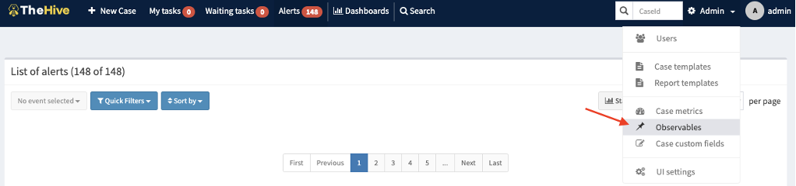

Enter `business-unit` (1) and select **Add dataType** (2). Perform the same
steps for the `document-id` entry.

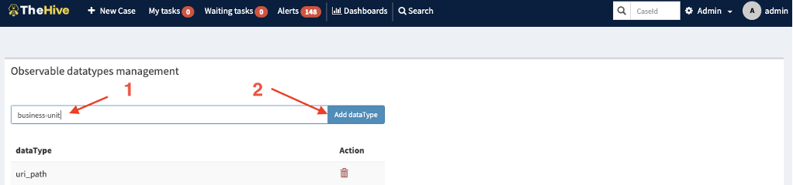

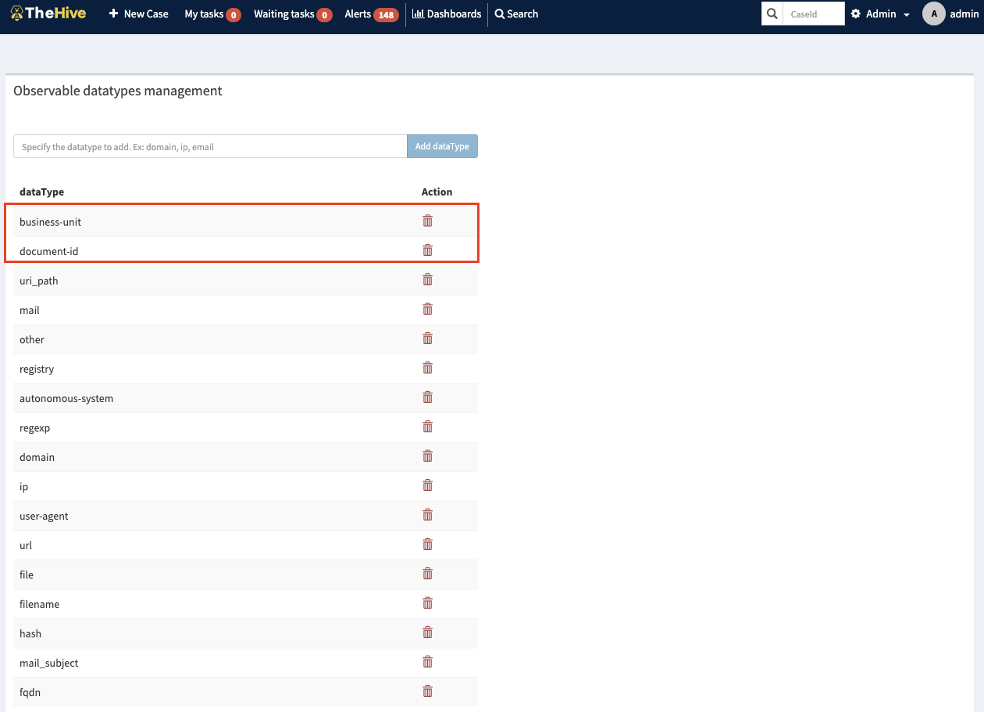

## Responder configuration

A dedicated responder is required to retrieve VMC data for a TheHive alert.
By default Cortex-supported responders live under
`/opt/Cortex-Analyzers/responders/`. The exact path is configurable in
`/etc/cortex/application.conf`.

Run the following commands on the server hosting Cortex:

```bash
cd /opt/Cortex-Analyzers/responders/
git clone https://github.com/DSecureMe/vmc-thehive-responder.git
cd vmc-thehive-responder
chmod o+x vmc.py
```

Then log in to the Cortex admin panel and pick **Organization** (1) →
**Responders** (2). Click **Refresh responders**, search for `vmc` (3) and
press **Enable** (4) — the responder configuration window appears.

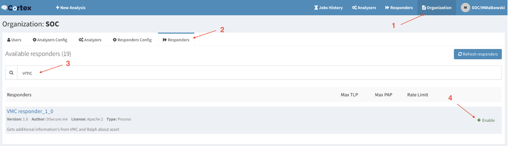

Fill in the responder configuration:

| Name                      | Description                                                                |
|---------------------------|----------------------------------------------------------------------------|
| `vmc_host`                | IP address of the server where `vmc-admin` is installed.                   |
| `vmc_port`                | Port of the `vmc-admin` service.                                           |
| `vmc_schema`              | `http` or `https`, depending on the VMC configuration.                     |
| `vmc_insecure_connection` | `true` if there is no certificate or the certificate is self-signed.       |
| `vmc_token`               | API token from VMC (see [Creation of API tokens](../Admin-Panel/README.md#creation-of-api-tokens)). |

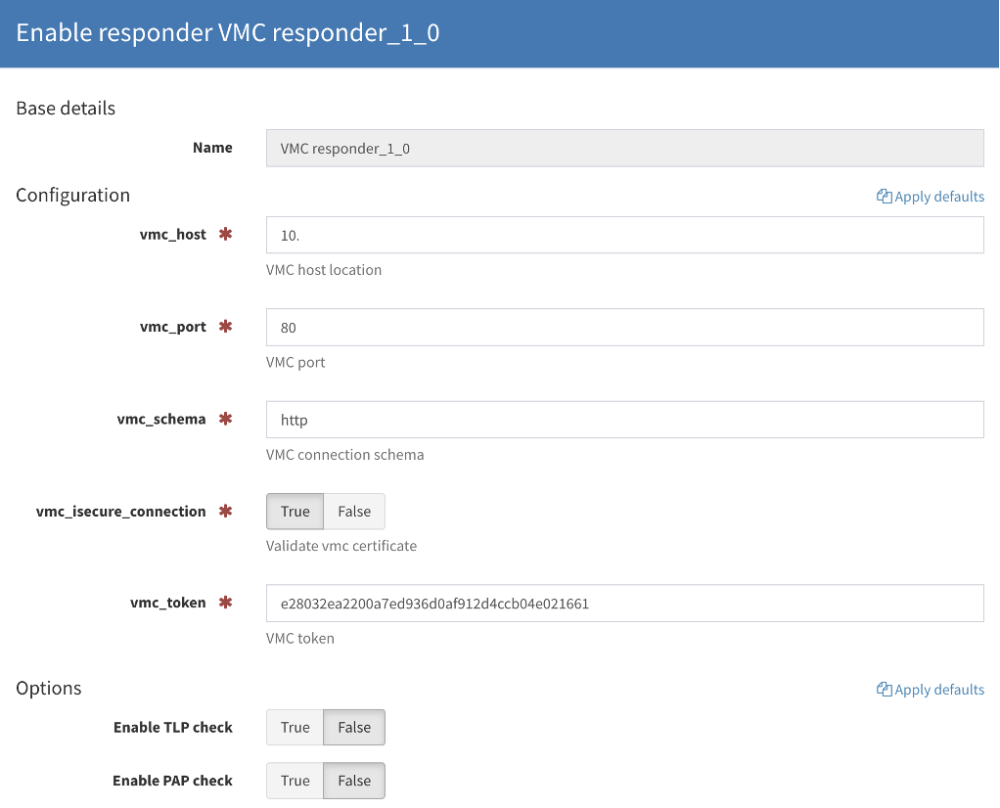

A new option then appears in TheHive that lets you fetch additional
information about an IP address from VMC. After the responder finishes, the
alert is tagged with `downloaded asset data from VMC`.

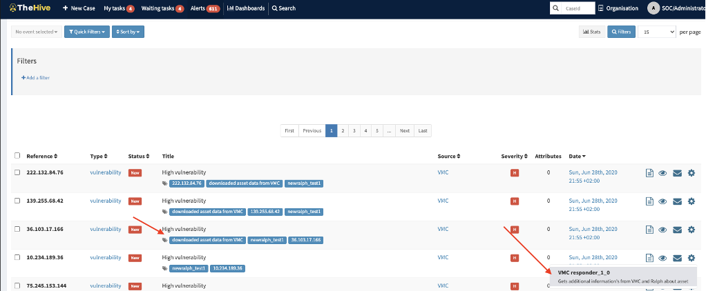

## TheHive webhooks configuration

TheHive can notify external systems about events such as alert or task
creation. VMC uses TheHive webhooks for vulnerability alerts to
automatically create tasks and cases — facilitating the work of
administrators and tracking the vulnerability-management process. The same
mechanism lets VMC pull TheHive task-log entries and stamp them into the
vulnerability document's `tags` field — useful for tracking remediation
indicators.

To enable the integration, add an endpoint to TheHive 4's
`/etc/thehive/application.conf`:

```hocon
notification.webhook.endpoints = [
  {
    name: vmc
    url: "http://<vmc admin host>/api/v1/webhook/thehive"
    version: 0
    wsConfig: {}
  }
]
```

Wire the notifier to TheHive:

```bash
read -p   'Enter TheHive URL: '     thehive_url
read -p   'Enter your login: '      thehive_user
read -s -p 'Enter your password: '  thehive_password

curl -XPUT -u "$thehive_user:$thehive_password" \
     -H 'Content-Type: application/json' \
     "$thehive_url/api/config/organisation/notification" \
     -d '
{
  "value": [
    {
      "delegate": false,
      "trigger":  { "name": "AnyEvent" },
      "notifier": { "name": "webhook", "endpoint": "vmc" }
    }
  ]
}'
```

To let VMC import cases and create the corresponding tasks, configure a
back-link in **Webhooks** (1) → **TheHive4** (2) → **+** (3). VMC currently
supports integration with a single TheHive instance.

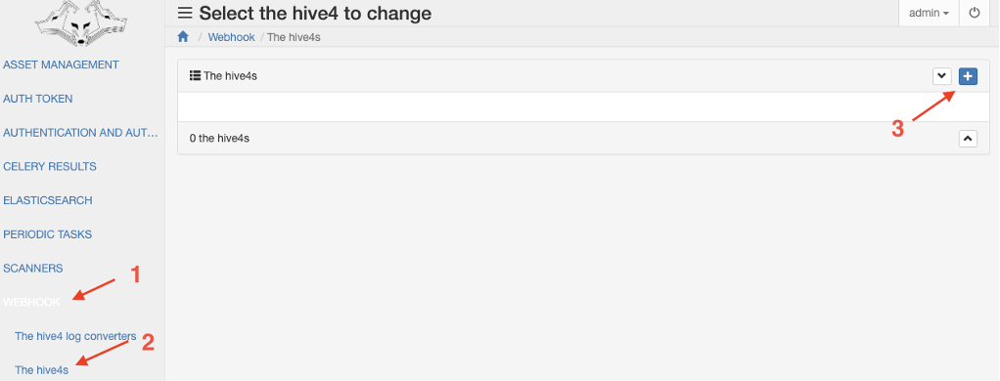

Fill in the connection form:

| Name                            | Description                                                                                                  |
|---------------------------------|--------------------------------------------------------------------------------------------------------------|
| Name                            | Configuration name.                                                                                          |
| Schema                          | Connection protocol — `http` or `https`.                                                                     |
| Host                            | Host where TheHive is installed.                                                                             |
| Port                            | Port on which TheHive is listening.                                                                          |
| Token                           | Authorisation token for TheHive.                                                                             |
| Insecure                        | SSL certificate verification parameter (disabled by default).                                                |
| Enabled                         | Activates the integration.                                                                                   |
| Vulnerability status converter  | List of TheHive task-log statuses that should be mirrored to the `tags` field of the vulnerability document. |

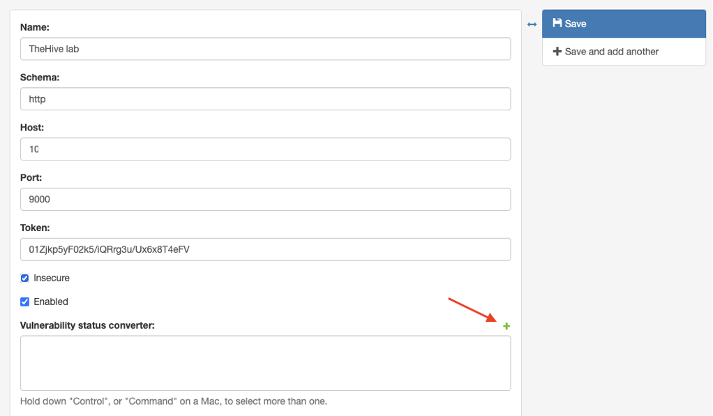
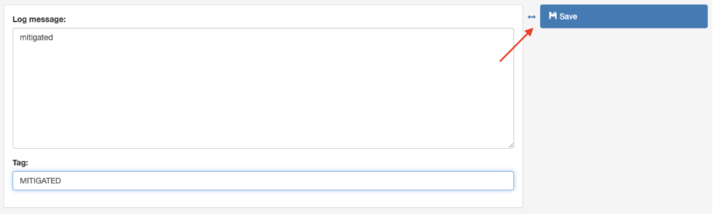
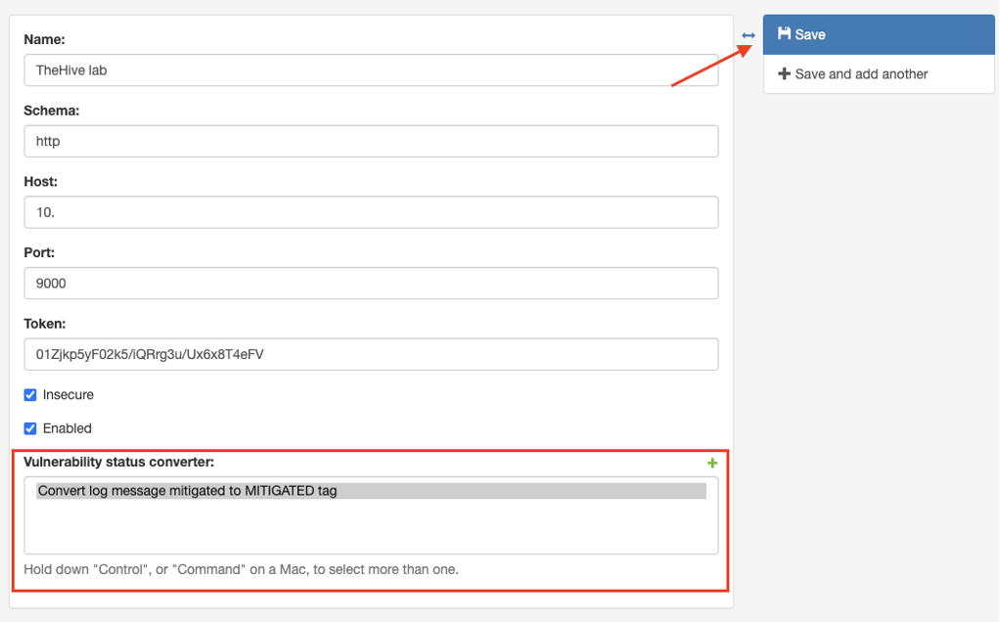
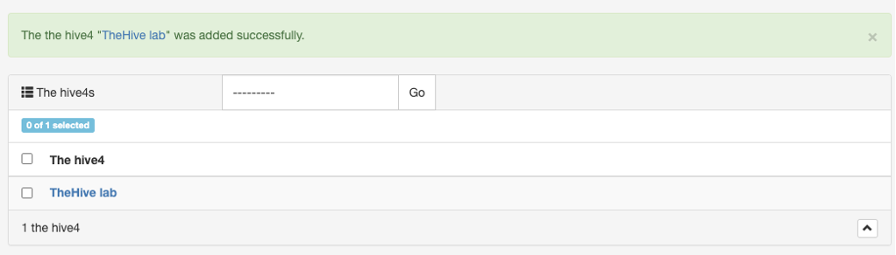
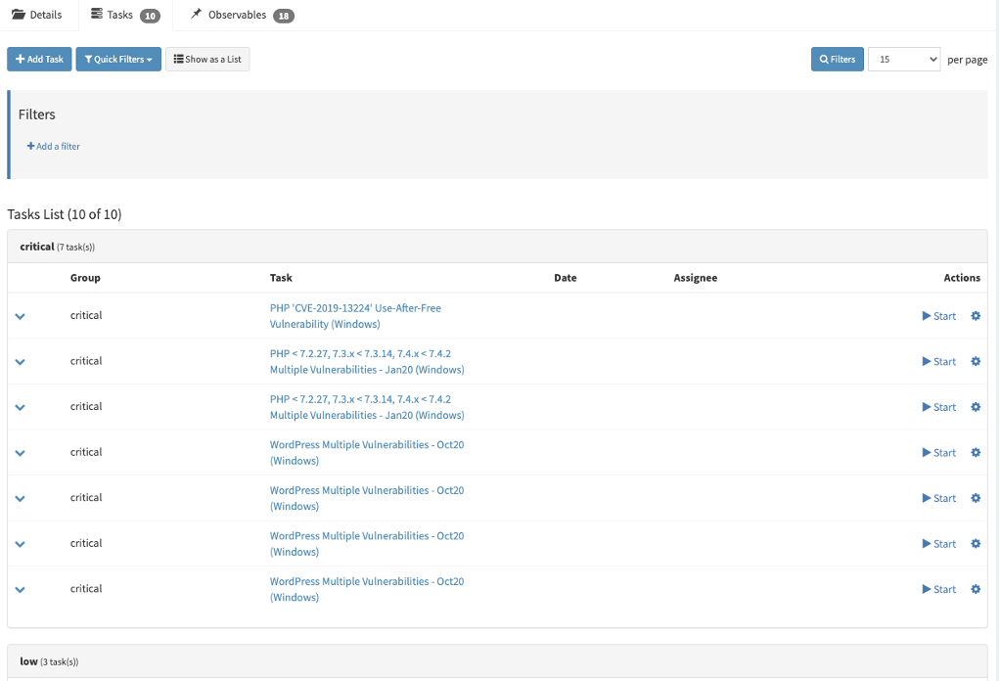
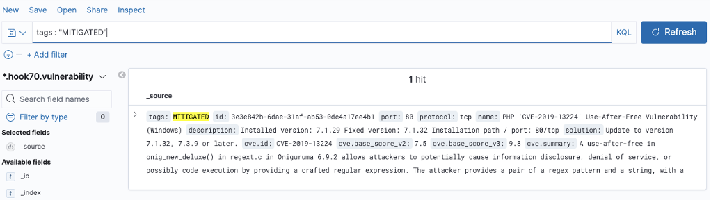
