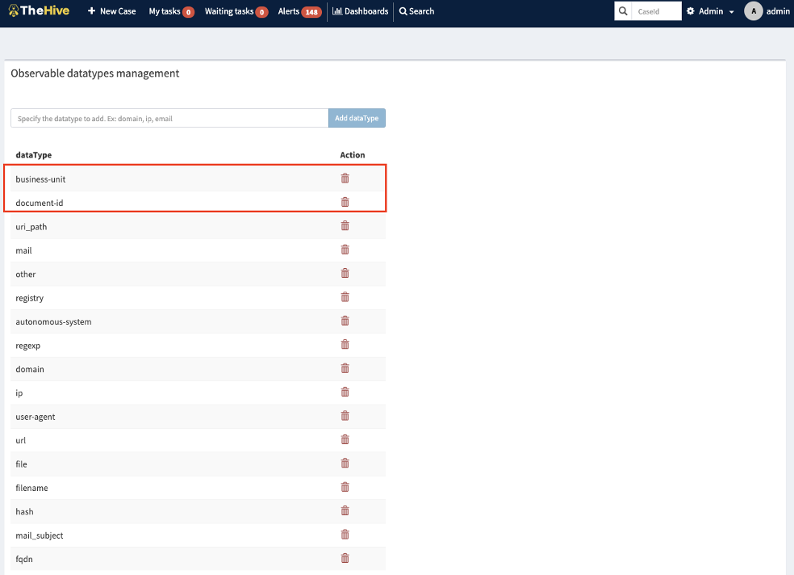
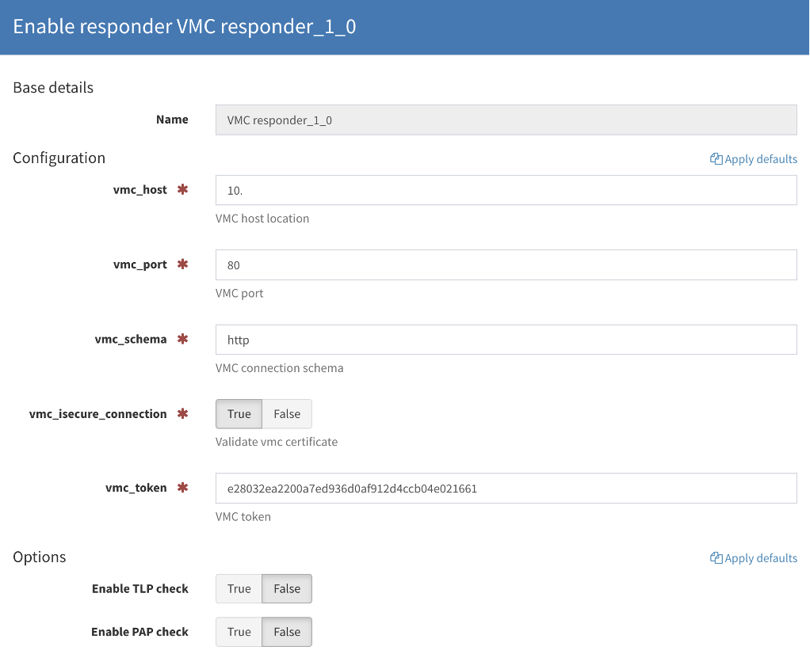

# Integration with The Hive
The Hive is an open security incident response platform (SIRP). Along with The Hive software, the Cortex module is delivered, which allows you to automate some of the analysts' work. VMC using the ElastAlert module allows you to create additional security events. On the other hand, an additional responder allows you to enrich the information of other events with information contained in the VMC and the integrated resource database.

##  ElastAlert configuration
ElastAlert is an anomaly alerting framework that works on the basis of data patterns contained in Elasticsearch. The package is installed with the command:
```
pip3 install elastalert
```

In order for ElastAlert to function as a service on a linux system, create a file in the `/usr/lib/systemd/system/elastalert.service` directory with the following content:
```
[Unit]
Description=Elastalert
After=elasticsearch.service

[Service]
Type=simple
Restart=on-failure
ExecStart=/usr/local/bin/elastalert   --config /home/elastalert/config.yaml

[Install]
WantedBy=multi-user.target
```
Activation and launch of the website is carried out using the following commands:
```
systemctl enable elastalert
systemctl start elastalert
```

Set the following values in the config.yaml configuration file:

|Name                        |Description
|----------------------------|------------
|rules_folder                |path to the folder containing the rules
|es_host                     |the Elasticsearch cluster host name
|es_port                     |the port on which the Elasticsearch cluster is listening
|use_ssl                     |optional; Use of an encrypted connection.
|verify_certs                |optional; Verification of certificates
|es_username                 |optional; User used to connect to the Elasticsearch cluster
|es_password                 |optional; Password used to connect to the Elasticsearch cluster
|hive_connection.hive_host   |the address of the server where The Hive is installed
|hive_connection.hive_port   |the port on which The Hive is listening
|hive_connection.hive_apikey |authorization token to connect to The Hive

A more detailed description of the parameters and configuration methods is described in the documentation available at https://elastalert.readthedocs.io/en/latest/elastalert.html.

## Creating Alerts
Alerts are responsible for taking action based on the match. A match is typically a dictionary containing values from a document in Elasticsearch, but can contain any data added by the rule type. More information can be found in the documentation at https://elastalert.readthedocs.io/en/latest/elastalert.html.

Sample configuration of a rule for integration with The Hive informing about a new resource detected while conducting vulnerability scans.
```
name: Discovered new asset
type: any
index: "*asset"
alert: hivealerter
alert_on_new_data: true
timestamp_field: "modified_date"
realert:
    minutes: 0

filter:
  - query:
      query_string:
          query: 'tags: DISCOVERED'

hive_alert_config:
  title: '{rule[name]}: {match[ip_address]}'
  type: 'vmc\asset'
  source: '{match[source]}'
  description: '{rule[name]}: {match[ip_address]}'
  severity: 3
  tags: ['{match[tags]}', '{match[ip_address]}', '{match[tenant]}', 'Discovered Asset']
  tlp: 1
  status: 'New'

hive_observable_data_mapping:
 - ip: '{match[asset][ip_address]}'
 - business-unit: '{match[tenant]}'
 - document-id: '{match[_id]}'
```


Then enter business-unit [1] and select Add dataType [2]. Actions should be performed similarly for the document-id entry.




## Responder configuration
An additional responder is required to be able to retrieve additional information from VMC for an alert in The Hive. By default, the location of all Cortex supported responders is at `/opt/Cortex-Analyzers/responders/`. Additionally, the location can be checked in the `/etc/cortex/application.conf` configuration file.

All the commands below should be performed on the server where Cortex is installed.
```
cd /opt/Cortex-Analyzers/responders/
git clone https://github.com/DSecureMe/vmc-thehive-responder.git
cd vmc-thehive-responder
chmod o+x vmc.py
```

Then log in to the Cortex administration panel (Figure 48), and select the options “Organization” [1], “Responders” [2]. After selecting the "Refresh responders" option and entering "vmc" [3] in the search engine, a new responder should appear. After selecting the “Enable” [4] option, the responder configuration window will appear.


For the responder to work properly, set the following values and then select the Save option:

|Name                    |Description
|------------------------|-----------
|vmc_host                |IP address of the server where vmc-admin is installed
|vmc_port                |vmc-admin service port
|vmc_schema              |selectable http or https depending on the vmc configuration
|vmc_insecure_connection |true if there is no certificate or the certificate is self-signed
|vmc_token               |token for vmc-admin api downloaded from the VMC configuration panel described in the chapter Creating API tokens



After correct configuration in The Hive there will be a new option that allows you to download additional information about the IP address from VMC. After the responder is finished and the data has been downloaded, the alert will be assigned a new tag “downloaded asset data from VMC”.


## The Hive webhooks Configuration
The Hive can notify the external system of events occurring in the system, e.g. creating an alert or a task. VMC uses The Hive webhooks to handle vulnerability alerts to automatically create tasks and cases from them in order to facilitate the work of administrators and to track the vulnerability management process. In addition, enabling The Hive webhooks functionality allows you to retrieve information from The Hive Task Logs and mark them in the tag fields of vulnerability documents. This allows, among other things, to handle indicators related to vulnerability mitigation.

To enable integration with VMC, add an entry in the configuration The Hive 4 `/etc/thehive/application.conf`:
```
notification.webhook.endpoints = [
  {
    name: vmc
    url: "http://10.31.2.7/api/v1/webhook/thehive"
    version: 0
    wsConfig: {}
   }
]
```

Then execute the commands:
```
read -p 'Enter the URL of TheHive: ' thehive_url
read -p 'Enter your login: ' thehive_user
read -s -p 'Enter your password: ' thehive_password

curl -XPUT -u$thehive_user:$thehive_password -H 'Content-type: application/json' $thehive_url/api/config/organisation/notification -d '
{
  "value": [
    {
      "delegate": false,
      "trigger": { "name": "AnyEvent"},
      "notifier": { "name": "webhook", "endpoint": "vmc" }
    }
  ]
}'
```

In order to enable VMC to import case alerts and create corresponding tasks, configure a backlink in the Webhook [1] tab, then select The hive4s [2] and click + [3]. VMC currently supports integration with only one instance of The Hive.


In the newly opened tab, complete the data specified in Table below.

|Name                            |Description
|--------------------------------|-----------
|Name                            |configuration name
|Schema                          |connection protocol (selectable from http and https)
|Host                            |the address of the server where The Hive is installed
|Port                            |the port on which The Hive is listening
|Token                           |authorization token to connect to The Hive
|Insecure                        |SSL certificate verification parameter (disabled by default)
|Enabled                         |activation of integration
|Vulnerability status conveneter |list of statuses entered in The Hive Task Log that should be changed and added to the tag field in the vulnerability document

How to configure your connection to The Hive


Adding a new converter The Hive Task log to tag in Vulnerability Document


Configuration saving


Configuration successfully added to the system


Sample list of tasks in The Hive


The content of the tag field in the vulnerability document after adding the Task Log with mitigated entry
