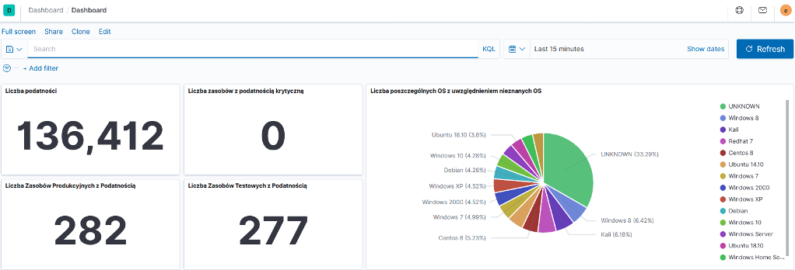
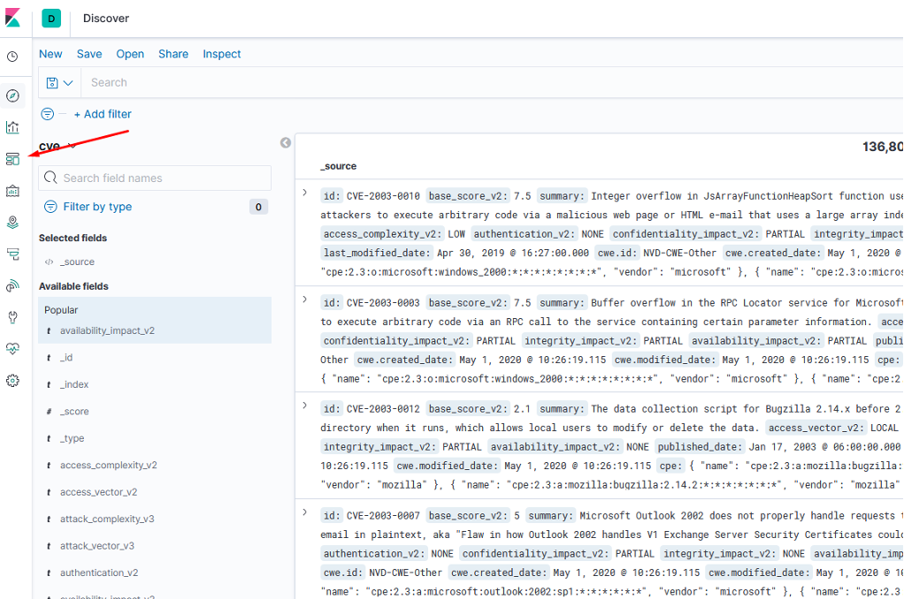
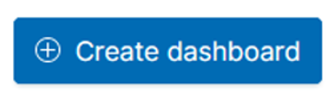
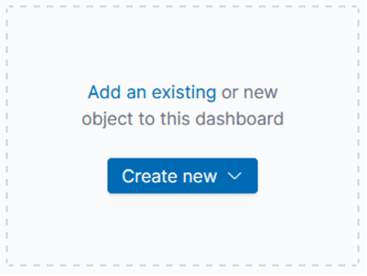
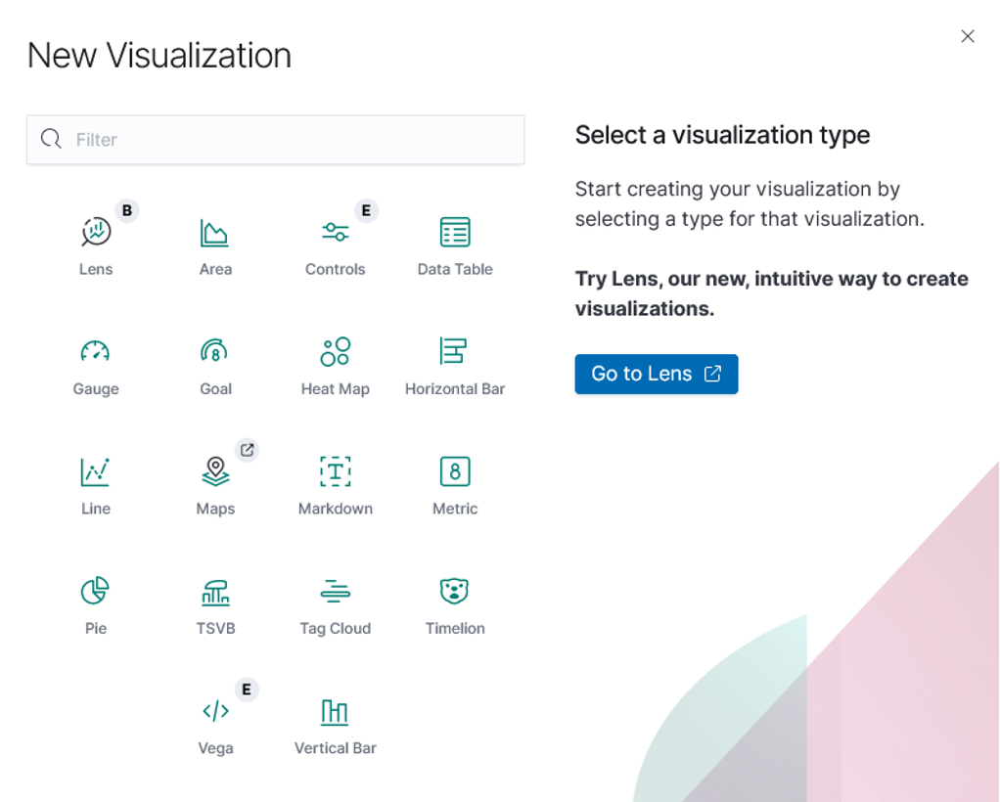
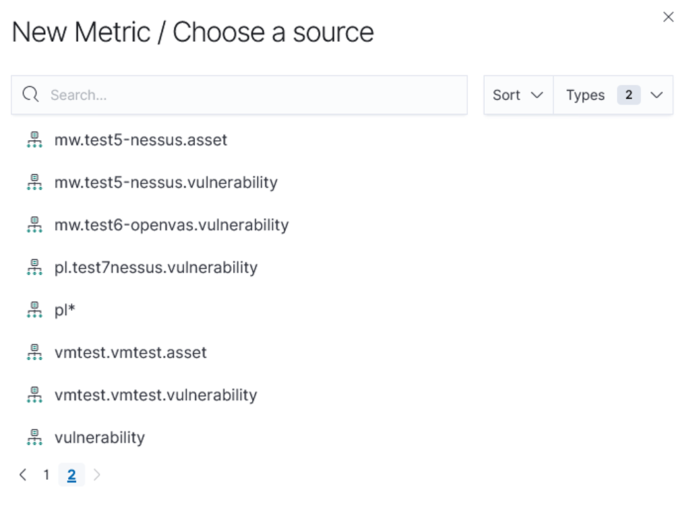
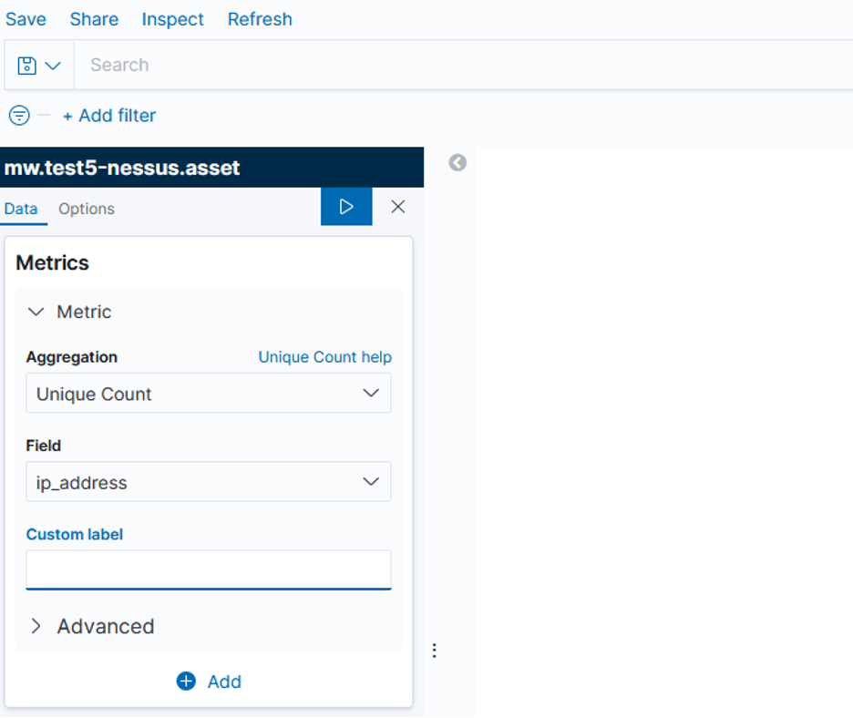
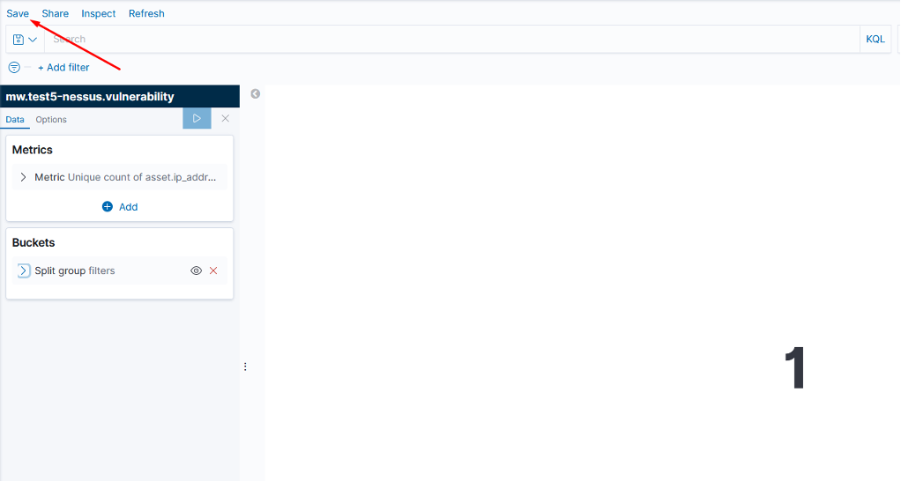

# Introduction to KPI
KPI (Key Performance Indicator) - indicators that allow you to assess the performance and success in the assumption of the goals being performed. From the vulnerability management point of view, KPIs indicate the level of performance in VM processes, as well as AM and PM. VMC has developed capabilities of reporting metrics, the limitation of which may only be the user's creativity and knowledge and proficiency in filtering data using built-in queries.

The data is presented on Dashboards that can be created on the basis of a specific categorization.

Select the Dashboard from the menu on the left in the Dashboard tab.

Then, to create a new one, click **Create dashboard**.  

 

 

When creating a new metric, we choose the method of data visualization.

In this example, we will select the "Metric" visualization and then the index on which the data will be filtered.

|Name                         | Description                                                      |
|-----------------------------|------------------------------------------------------------------|
|Aggregation                  |extract fields from documents to generate selected data value:  **Average** - Average value.Count - The total number of documents that match the query, which allows you to visualize the number of documents in the tray. The number is the default.   **Max** - The highest value. **Median** - Value in 50% **Min** - The Lowest value. **Percentile ranks** - Returns the percentile rankings for the values in the specified numeric field. Select a numeric field from the drop-down list, and then specify one or more percentile rank values in the Values fields. **Percentiles** - Divides the values in a numeric field into specified percentile ranges. Select a field from the drop-down list, and then specify one or more ranges in the Percentiles fields. **Standard Deviation** - Requires a numeric field. Uses extended aggregation of statistics. **Sum** - Total value. **Top hit** - Returns a sample of single documents. When Top Hit aggregation is matched against more than one document, you must choose the value concatenation technique. Techniques include average, minimum, maximum, and sum. **Unique Count** - Number of unique results.
|Field                        |at this point, the field whose metric we will present is selected
|Custom Label                 |The name of the metric
|Advanced                     |in this field you can add a batch written in JSON

In the Buckets tab, we choose how the data is to be divided or filtered. After selecting all options, we save the metric.

After creating the metric, it will appear on the selected dashboard. Metrics can be freely removed, added, and the size and position of the graphs presenting them can be changed.
