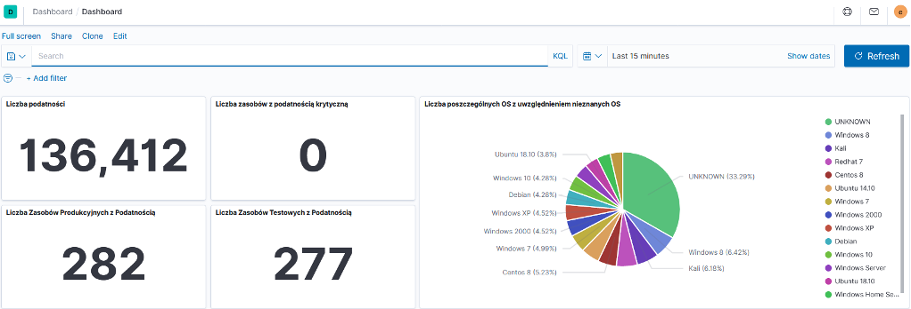
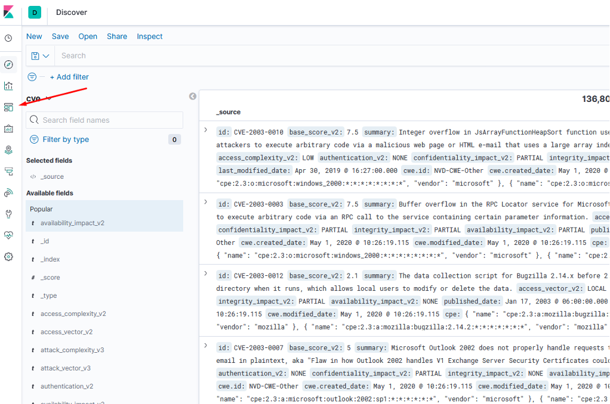
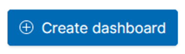
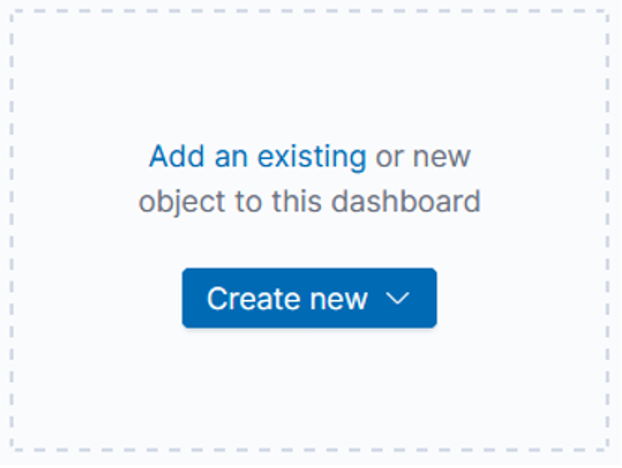
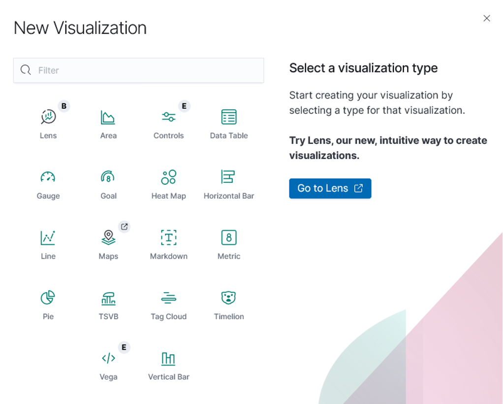
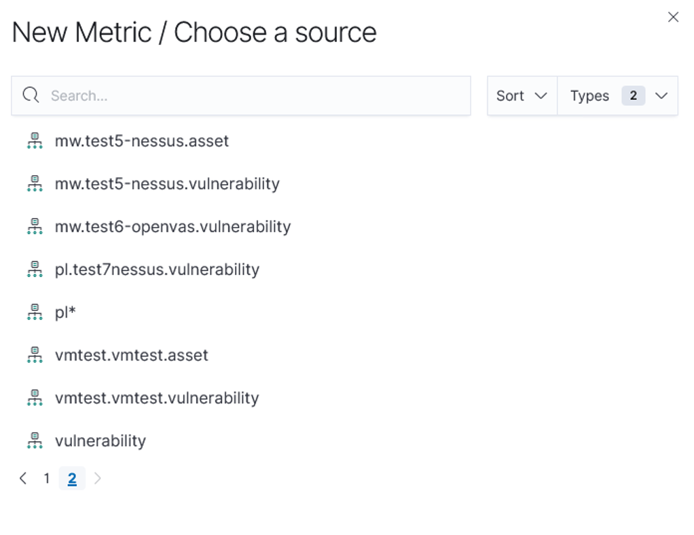
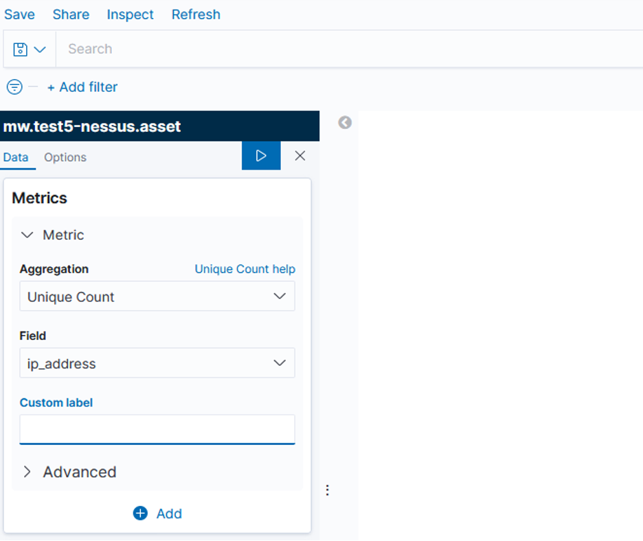
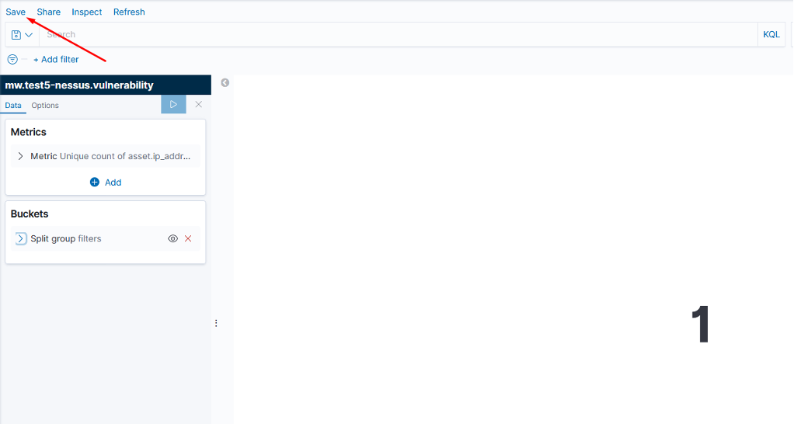

# Introduction to KPI

KPI (Key Performance Indicator) — metrics that quantify the performance and
success of business goals. From a vulnerability-management perspective KPIs
reveal the level of performance of the VM, AM and PM processes. VMC's
reporting capabilities are limited mostly by the user's creativity and
fluency in Kibana queries.

Data is presented on dashboards that can be assembled around any
categorisation.

Open the **Dashboard** entry from the side menu:

To create a new dashboard click **Create dashboard**.

When creating a new metric, pick the visualisation type:

In this example we pick the **Metric** visualisation and then the index that
will be queried:

| Name         | Description                                                                                                                                                                                                                                                                                                                                                                                                                                                                                                                                                                                                                                                                                                                                                                                                                                                                                                                            |
|--------------|----------------------------------------------------------------------------------------------------------------------------------------------------------------------------------------------------------------------------------------------------------------------------------------------------------------------------------------------------------------------------------------------------------------------------------------------------------------------------------------------------------------------------------------------------------------------------------------------------------------------------------------------------------------------------------------------------------------------------------------------------------------------------------------------------------------------------------------------------------------------------------------------------------------------------------------|
| Aggregation  | Aggregates field values from documents into a single metric value. Supported aggregations: **Average** (average value), **Count** (total number of matching documents — default), **Max** (highest value), **Median** (value at the 50th percentile), **Min** (lowest value), **Percentile ranks** (percentile rankings for values in a numeric field — pick the field and one or more *Values*), **Percentiles** (divides values into specified percentile ranges — pick the field and one or more *Percentiles*), **Standard deviation** (requires a numeric field; uses extended statistics aggregation), **Sum** (total value), **Top hit** (returns a sample of individual documents; if Top Hit matches more than one document, pick a concatenation technique — average / min / max / sum), **Unique count** (number of unique results).                                                                                            |
| Field        | The document field whose metric is being presented.                                                                                                                                                                                                                                                                                                                                                                                                                                                                                                                                                                                                                                                                                                                                                                                                                                                                                    |
| Custom label | Display name of the metric.                                                                                                                                                                                                                                                                                                                                                                                                                                                                                                                                                                                                                                                                                                                                                                                                                                                                                                            |
| Advanced     | Optional JSON payload appended to the aggregation.                                                                                                                                                                                                                                                                                                                                                                                                                                                                                                                                                                                                                                                                                                                                                                                                                                                                                     |

In the **Buckets** tab pick how the data is sliced or filtered, then save
the metric:

After saving, the metric appears on the dashboard. Metrics can be added,
removed and resized freely; the position of their panels can be adjusted by
drag-and-drop.
